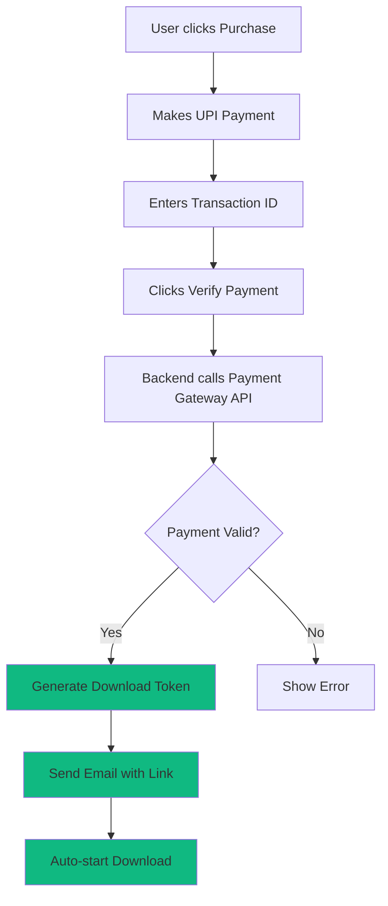
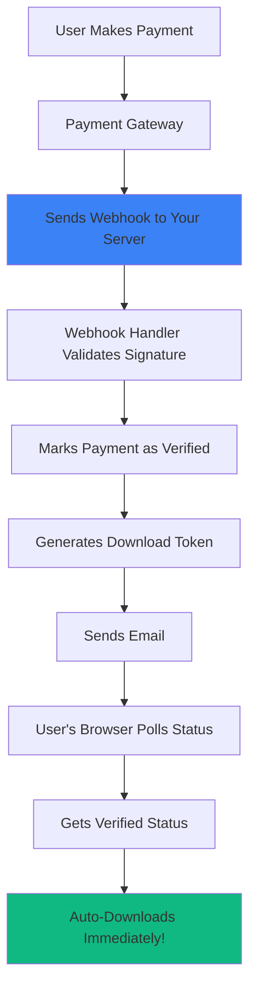

# 🎉 Automated Payment Verification System

## Overview

This system provides **fully automated payment verification** for your Interview AI desktop app. When a user makes a payment, the system automatically verifies it with the payment gateway API and allows immediate download - **no manual verification needed!**

---

## ⚡ Key Features

- ✅ **Auto-Verification in 10-30 seconds** - Integrates with Razorpay, Cashfree, Paytm, PhonePe APIs
- ✅ **Instant Downloads** - Users get download link immediately after payment
- ✅ **Secure Tokens** - One-time download tokens that expire in 24 hours
- ✅ **Webhook Support** - Instant notifications for 1-2 second verification
- ✅ **Email Automation** - Sends download links and confirmations automatically
- ✅ **Polling Fallback** - Auto-polls payment status if webhook delayed
- ✅ **Multiple Gateways** - Support for Razorpay, Cashfree, Paytm, PhonePe
- ✅ **SQLite Database** - Stores all payment records securely
- ✅ **Admin Notifications** - Get notified of every payment

---

## 📁 System Components

### Backend Files

| File | Purpose |
|------|---------|
| `python/payment_verifier.py` | Core payment verification engine with gateway APIs |
| `api/verify-payment-auto.js` | API endpoint for payment verification and polling |
| `api/payment-webhook.js` | Webhook handler for instant payment notifications |
| `api/email-service.js` | Email automation (SendGrid/Mailgun/AWS SES) |
| `python/payment_verifier_node.js` | Node.js wrapper for Python verifier |

### Frontend Files (Updated)

| File | Changes |
|------|---------|
| `public/payment.js` | Added auto-polling, real-time status, auto-download |
| `public/payment.css` | Added polling status styles and animations |

### Database

| File | Purpose |
|------|---------|
| `payments.db` | SQLite database (auto-created) with payment records |

### Documentation

| File | Purpose |
|------|---------|
| `AUTOMATED_PAYMENT_QUICK_START.md` | 5-minute setup guide |
| `AUTOMATED_PAYMENT_SETUP_GUIDE.md` | Complete setup with all gateways |
| `AUTOMATED_PAYMENT_README.md` | This file - system overview |

---

## 🚀 Quick Start

### Step 1: Get API Keys

Sign up with a payment gateway:
- **Razorpay** (recommended): https://razorpay.com
- **Cashfree**: https://cashfree.com
- **PhonePe**: https://business.phonepe.com
- **Paytm**: https://business.paytm.com

### Step 2: Configure

Add to `.env`:
```bash
RAZORPAY_KEY_ID=rzp_live_xxxxxxxxxxxxx
RAZORPAY_KEY_SECRET=xxxxxxxxxxxxxxxxxxxxx
RAZORPAY_WEBHOOK_SECRET=xxxxxxxxxxxxxxxxxxxxx
SENDGRID_API_KEY=SG.xxxxxxxxxxxxxxxxxxxxx
FROM_EMAIL=downloads@interview-ai.app
```

### Step 3: Install

```powershell
npm install
pip install requests
npm install @sendgrid/mail
```

### Step 4: Deploy

```powershell
vercel --prod
```

**Done!** Your payment system is now fully automated! 🎉

---

## 🔄 How It Works

### User Flow (Automated)



### Technical Flow

1. **Payment Submission** (Frontend)
   - User fills form with email, name, transaction ID
   - Calls `/api/verify-payment-auto` with payment data

2. **Payment Record Creation** (Backend)
   - Creates record in SQLite database
   - Status: `pending`

3. **Auto-Verification** (Backend)
   - Calls payment gateway API (Razorpay/Cashfree/etc.)
   - Validates transaction amount, status, details
   - If valid → Update status to `verified`

4. **Token Generation** (Backend)
   - Generates secure SHA-256 download token
   - Sets 24-hour expiry
   - Stores in database

5. **Email Notification** (Backend)
   - Sends beautiful HTML email with download link
   - Includes download button and instructions
   - Auto-expires in 24 hours

6. **Download Initiation** (Frontend)
   - Polling detects verification complete
   - Shows success message
   - Auto-triggers download
   - User gets app immediately!

### Webhook Flow (Faster - 1-2 seconds)



---

## 🎨 User Experience

### Before (Manual Verification)

```
User pays → Waits 5-10 minutes → Checks email → Downloads
Total time: 5-10 minutes ❌
```

### After (Automated Verification)

```
User pays → Verified in 10-30 seconds → Downloads immediately!
Total time: 10-30 seconds ✅
```

### With Webhook (Instant)

```
User pays → Verified in 1-2 seconds → Downloads immediately!
Total time: 1-2 seconds 🚀
```

---

## 💰 Payment Gateway Options

### Comparison

| Gateway | Transaction Fee | Setup Time | Verification Speed |
|---------|----------------|------------|-------------------|
| **Razorpay** | 2% + ₹0 | 5 minutes | 10-30 seconds |
| **Cashfree** | 1.95% | 10 minutes | 10-30 seconds |
| **PhonePe** | 1.99% | 15 minutes | 10-30 seconds |
| **Paytm** | 2% | 15 minutes | 10-30 seconds |

### Cost Example (₹3,999 sale)

- **Razorpay**: You pay ₹80 fee → Receive ₹3,919
- **Cashfree**: You pay ₹78 fee → Receive ₹3,921

All gateways supported! Choose what works best for you.

---

## 📧 Email Templates

The system sends 3 types of emails automatically:

### 1. Download Link Email
- Beautiful HTML with download button
- Installation instructions
- Feature list
- 24-hour expiry notice

### 2. Payment Confirmation Email
- Payment receipt
- Transaction details
- Amount and date

### 3. Admin Notification Email
- New payment alert
- Customer details
- Payment status

### Supported Email Services

- **SendGrid** (recommended) - Free 100 emails/day
- **Mailgun** - Free 5,000 emails/month
- **AWS SES** - $0.10 per 1,000 emails

---

## 🔐 Security Features

### Payment Validation
- ✅ Transaction ID verification with gateway API
- ✅ Amount validation (prevents fraud)
- ✅ Duplicate payment detection
- ✅ Webhook signature verification

### Download Security
- ✅ One-time use tokens (SHA-256)
- ✅ 24-hour expiry
- ✅ User-specific tokens
- ✅ No permanent download links

### Data Protection
- ✅ SQLite database with indexes
- ✅ Environment variables for secrets
- ✅ HTTPS only in production
- ✅ No API keys in client code

---

## 📊 Database Schema

```sql
CREATE TABLE payments (
    id INTEGER PRIMARY KEY AUTOINCREMENT,
    payment_id TEXT UNIQUE NOT NULL,       -- PAY-1234567890-ABCD1234
    transaction_id TEXT,                    -- Gateway transaction ID
    customer_email TEXT NOT NULL,
    customer_name TEXT NOT NULL,
    customer_phone TEXT,
    product_type TEXT NOT NULL,             -- windows, mac
    amount INTEGER NOT NULL,                -- In rupees
    currency TEXT DEFAULT 'INR',
    payment_method TEXT,                    -- upi, card, netbanking
    gateway TEXT,                           -- razorpay, cashfree
    status TEXT DEFAULT 'pending',          -- pending, verified, failed
    download_token TEXT,                    -- SHA-256 token
    token_expires_at TEXT,                  -- ISO 8601 timestamp
    created_at TEXT NOT NULL,
    verified_at TEXT,
    metadata TEXT                           -- JSON additional data
);
```

---

## 🧪 Testing

### Test Locally

```powershell
# Start development server
npm run dev

# Open payment page
Start-Process "http://localhost:3000/payment.html?product=windows"

# Test payment verification
# Use test mode API keys from payment gateway
```

### Test Verification

```powershell
# Check database
sqlite3 payments.db "SELECT payment_id, customer_email, status, verified_at FROM payments;"

# Test email sending
node -e "const {getEmailService} = require('./api/email-service'); const service = getEmailService(); service.sendDownloadEmail({email:'test@example.com',name:'Test User',product:'Interview AI',downloadUrl:'https://example.com',downloadToken:'test123',amount:3999});"

# Test webhook
curl -X POST http://localhost:3000/api/payment-webhook?gateway=razorpay \
  -H "Content-Type: application/json" \
  -d '{"event":"payment.captured","payload":{"payment":{"entity":{"id":"pay_test123","amount":399900,"status":"captured"}}}}'
```

---

## 🐛 Troubleshooting

### Common Issues

| Issue | Solution |
|-------|----------|
| Payment verification timeout | Set up webhook for instant verification |
| Email not sending | Add SendGrid API key to `.env` |
| Invalid API credentials | Check API keys are correct and live (not test) |
| Download link not working | Check file exists in `/public/downloads/` |
| Webhook not working | Verify webhook URL in gateway dashboard |

### Debug Commands

```powershell
# View all payments
sqlite3 payments.db "SELECT * FROM payments ORDER BY created_at DESC LIMIT 10;"

# View pending payments
sqlite3 payments.db "SELECT payment_id, customer_email, amount, created_at FROM payments WHERE status='pending';"

# View verified payments
sqlite3 payments.db "SELECT payment_id, customer_email, download_token, token_expires_at FROM payments WHERE status='verified';"

# Check token expiry
sqlite3 payments.db "SELECT payment_id, download_token, token_expires_at FROM payments WHERE token_expires_at < datetime('now');"
```

---

## 📚 Documentation

### Quick References

1. **[Quick Start](AUTOMATED_PAYMENT_QUICK_START.md)** - Get started in 5 minutes
2. **[Full Setup Guide](AUTOMATED_PAYMENT_SETUP_GUIDE.md)** - Complete configuration for all gateways
3. **[This README](AUTOMATED_PAYMENT_README.md)** - System overview and architecture

### API Documentation

#### POST `/api/verify-payment-auto`

Create payment verification request.

**Request:**
```json
{
  "email": "user@example.com",
  "name": "John Doe",
  "phone": "9876543210",
  "transactionId": "pay_ABC123XYZ",
  "gateway": "razorpay",
  "paymentMethod": "upi",
  "product": "Interview AI - Windows",
  "amount": 3999,
  "productType": "windows"
}
```

**Response (Verified):**
```json
{
  "success": true,
  "verified": true,
  "payment_id": "PAY-1234567890-ABCD1234",
  "download_token": "a1b2c3d4e5f6...",
  "download_url": "/downloads/app.exe?token=a1b2c3d4e5f6...",
  "expires_at": "2025-01-07T12:00:00Z"
}
```

**Response (Pending):**
```json
{
  "success": true,
  "verified": false,
  "payment_id": "PAY-1234567890-ABCD1234",
  "message": "Payment verification pending",
  "estimated_time": "1-2 minutes",
  "poll_url": "/api/verify-payment-auto?payment_id=PAY-1234567890-ABCD1234"
}
```

#### GET `/api/verify-payment-auto?payment_id=PAY-123`

Check payment status (for polling).

**Response:**
```json
{
  "success": true,
  "verified": true,
  "payment_id": "PAY-1234567890-ABCD1234",
  "download_token": "a1b2c3d4e5f6...",
  "download_url": "/downloads/app.exe?token=a1b2c3d4e5f6...",
  "expires_at": "2025-01-07T12:00:00Z"
}
```

#### POST `/api/payment-webhook?gateway=razorpay`

Webhook handler for instant payment notifications.

Validates signature and marks payment as verified.

---

## 🎓 Best Practices

### Production Deployment

1. ✅ Use live API keys (not test keys)
2. ✅ Enable HTTPS only
3. ✅ Set up webhook for instant verification
4. ✅ Configure email service for notifications
5. ✅ Set up database backups
6. ✅ Monitor payment success rate
7. ✅ Set up error alerts
8. ✅ Test full flow end-to-end

### Performance Optimization

1. ✅ Use webhooks for 1-2 second verification
2. ✅ Cache payment gateway API responses
3. ✅ Use database indexes (already configured)
4. ✅ Rate limit API endpoints
5. ✅ Optimize email sending (batch if needed)

### Security Hardening

1. ✅ Rotate API keys regularly
2. ✅ Use environment variables (never commit `.env`)
3. ✅ Validate webhook signatures
4. ✅ Set token expiry (24 hours default)
5. ✅ Log all payment attempts
6. ✅ Monitor for fraud patterns

---

## 📞 Support & Resources

### Payment Gateway Support

- **Razorpay**: support@razorpay.com | https://razorpay.com/support
- **Cashfree**: care@cashfree.com | https://cashfree.com/support
- **PhonePe**: merchantsupport@phonepe.com
- **Paytm**: business@paytm.com

### External Documentation

- [Razorpay API Docs](https://razorpay.com/docs/api/)
- [Cashfree API Docs](https://docs.cashfree.com/)
- [PhonePe API Docs](https://developer.phonepe.com/)
- [SendGrid Email API](https://docs.sendgrid.com/)

---

## 🎉 Success!

Your Interview AI app now has a **fully automated payment and download system**!

### What You Get

- ✅ **10-30 second verification** (1-2 seconds with webhook)
- ✅ **Automatic download** immediately after payment
- ✅ **Email notifications** with download links
- ✅ **Secure tokens** that expire in 24 hours
- ✅ **Admin alerts** for every payment
- ✅ **Zero manual work** - completely automated!

### No More

- ❌ Manual payment verification
- ❌ Sending download links manually
- ❌ Long customer wait times
- ❌ Email back-and-forth

**Your payment system works 24/7 without you!** 🚀

---

**Version**: 1.0.0  
**Last Updated**: January 6, 2025  
**Supported Gateways**: Razorpay, Cashfree, Paytm, PhonePe  
**Supported Email**: SendGrid, Mailgun, AWS SES
