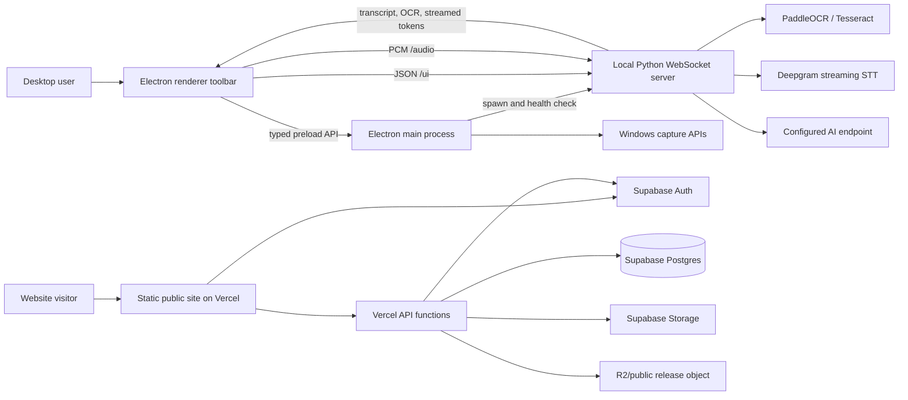
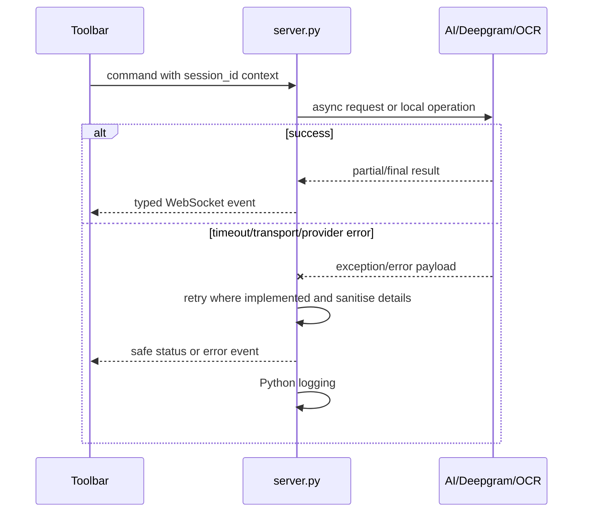
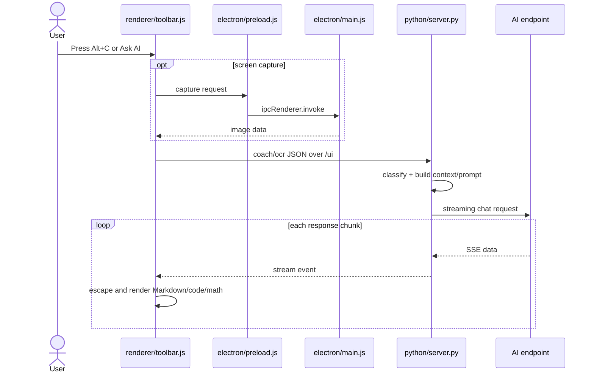
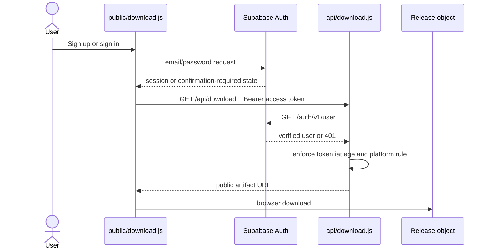
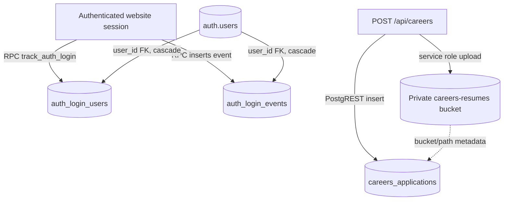
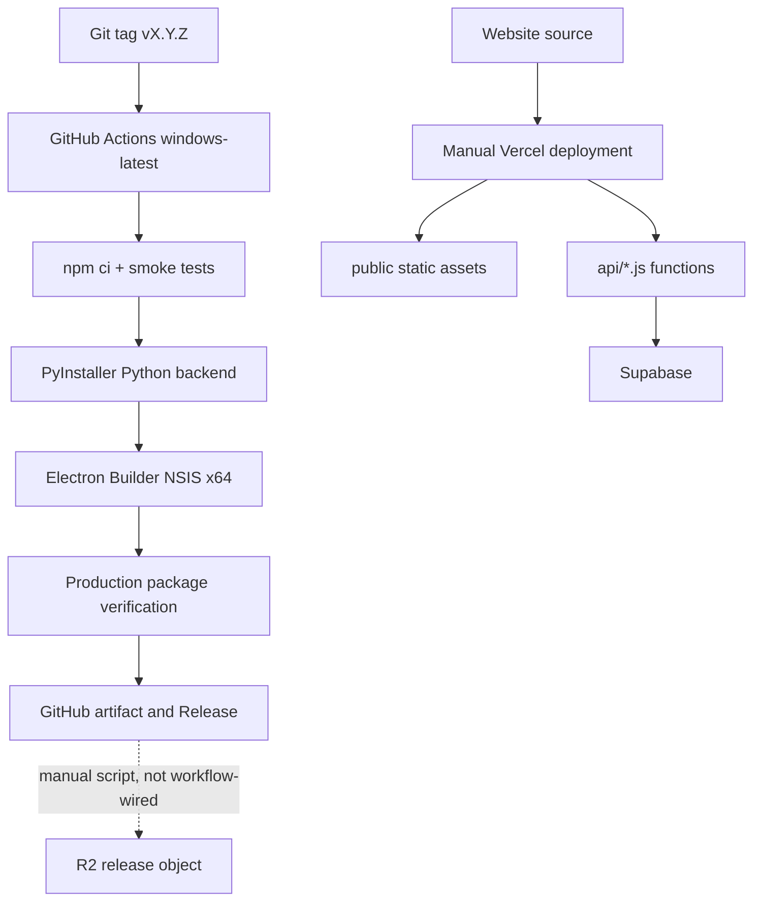
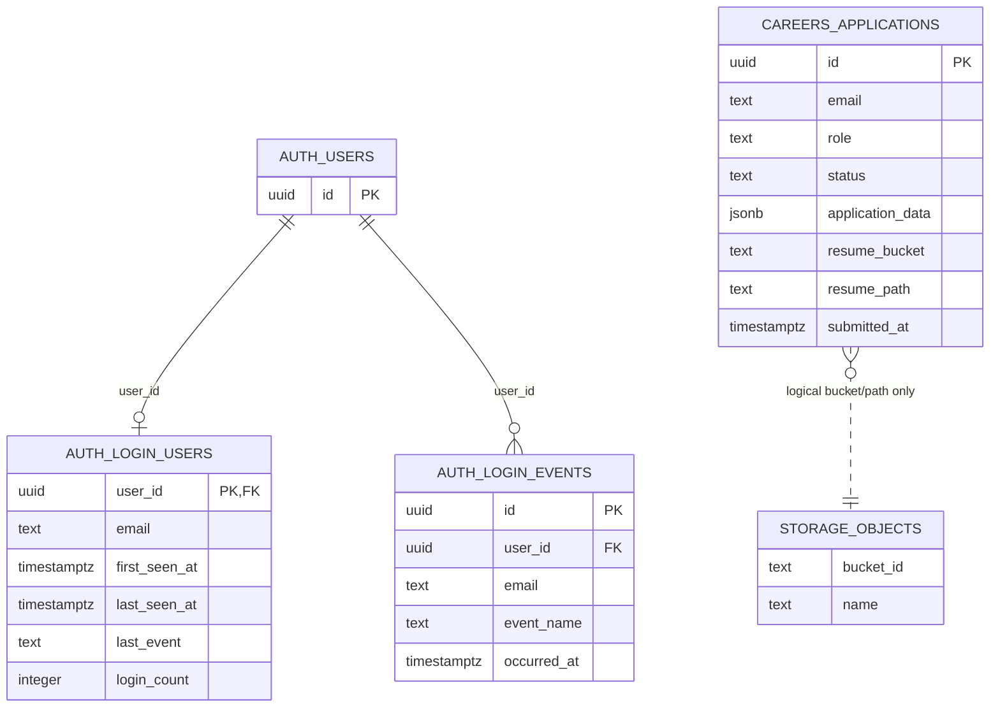
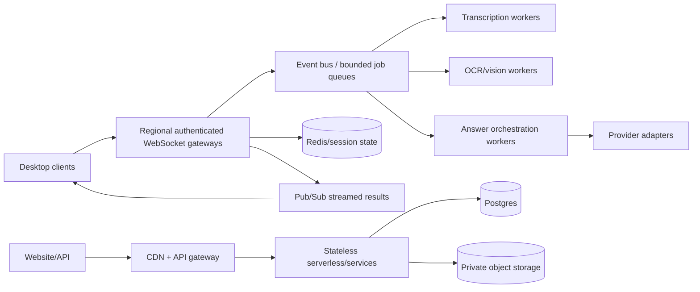

# Interview AI Assistant — Project Interview Preparation

> Repository audit date: 27 July 2026  
> Scope: the current working tree, including existing uncommitted changes, was treated as the implementation under review. No deployed Vercel, Supabase, R2, Deepgram, AI-provider, or installer environment was accessed.

## How to use this document

This guide uses four truth labels:

- **Implemented** — an end-to-end code path exists in the repository.
- **Partial** — meaningful code exists, but the path is incomplete, disconnected, misleadingly named, or has a known incompatibility.
- **Planned/scaffolded** — a module, setting, document, or UI stub exists without a working product flow.
- **Unverified externally** — the integration is coded, but no live credentials or deployed infrastructure were tested.

Important honesty boundary: the repository supports strong claims about breadth, Windows desktop integration, real-time WebSockets, OCR, transcription, BYOK AI, Supabase-backed website flows, packaging, and CI. It does **not** support claims of production traffic, measured latency, high availability, “100% privacy,” being undetectable, working at one million users, or every advertised provider working live.

---

# 1. Project Introduction

## Project identity

**Project name:** Interview AI Assistant  
**One-line description:** A Windows desktop interview copilot that combines live transcription, screen capture/OCR, resume and company context, and streaming answers from a user-selected AI provider.

## Problem, users, and use cases

The project reduces the time between hearing or seeing an interview question and assembling a structured answer. Its intended users are candidates practising or attending technical interviews, especially those who want to bring their own API keys rather than use a centrally billed AI service.

Main implemented desktop use cases:

1. Capture interviewer or system audio and transcribe it with Deepgram.
2. Capture a display/window, extract text locally with PaddleOCR/Tesseract, and optionally send a compressed image to a vision-capable AI provider.
3. Ask a typed question and stream a formatted answer into an always-on-top toolbar.
4. Add resume and company context so prompts are more relevant.
5. Configure OpenAI-compatible provider endpoints and store keys locally.

The public website adds authenticated Windows-download discovery and a public careers application flow. Those website flows are operationally separate from desktop interviewing.

## Why it is technically interesting

It crosses several boundaries in one repository: Electron process isolation and IPC, Windows-native capture, a Python `asyncio` WebSocket server, binary PCM streaming, third-party streaming APIs, OCR fallbacks, document parsing, local persistence, a serverless website, Supabase Auth/Postgres/Storage, PyInstaller, Electron Builder, and GitHub Actions. The hardest engineering is not a CRUD screen; it is coordinating state, latency, partial results, and failure handling across Electron, Python, the operating system, and external providers.

## Contribution supported by repository evidence

Git history attributes all 222 commits in the current history to the same email identity, split across the names `cp813` and `Mohitsagar236` (219 and 3 commits respectively). This supports describing the project as predominantly independently built and maintained, assuming those identities are yours. The code shows contribution across desktop UX, Python backend, OCR/transcription, AI answer quality, packaging, website authentication, careers submission, SQL setup, and CI/release automation. Do not claim team leadership or production ownership unless that is true outside the repository.

## Interview-ready introductions

### 30 seconds

> I built Interview AI Assistant, a Windows Electron application that listens to interview audio, captures screen content, and streams contextual answers from a bring-your-own-key AI provider. Electron handles the toolbar, shortcuts, and secure desktop integration, while a local Python WebSocket service handles transcription, OCR, resume context, prompt construction, and AI streaming. I also built the public download and careers website using Vercel serverless functions and Supabase.

### 60 seconds

> Interview AI Assistant is a Windows desktop copilot for technical interviews. The UI is an Electron toolbar with global shortcuts, stealth controls, audio recording, screen capture, resume upload, and streamed Markdown answers. A Python `asyncio` server runs locally and exposes WebSocket channels for UI control and audio. It integrates Deepgram for real-time transcription, PaddleOCR with Tesseract fallback for screenshots, document parsing for resume context, and OpenAI-compatible AI endpoints in a BYOK model. I packaged the Python service with PyInstaller and the desktop app with Electron Builder, and added GitHub Actions for smoke checks and tagged Windows releases. The repository also contains a Vercel-hosted static website with Supabase authentication for downloads and a Supabase-backed careers form. I would be transparent that some routing, analytics, provider, and admin paths are partial and that the local WebSocket and key-storage boundaries need hardening.

### Two minutes

> The project began with a practical latency problem: in an interview, a candidate may receive a question through audio, a shared screen, or direct text, and each input needs a different ingestion path. I used Electron because it provides a desktop window, global shortcuts, screen-capture APIs, an audio worklet, and Windows packaging while still allowing a fast HTML/CSS/JavaScript UI. I kept the AI and media pipeline in Python because its OCR, document-processing, and asynchronous networking ecosystem is stronger.
>
> At startup, Electron loads configuration, starts a packaged Python executable or a development Python server, discovers a localhost port, and opens an isolated renderer through a preload bridge. The toolbar connects to `/ui`, sends a session configuration, and uses a second `/audio` WebSocket for PCM audio. Deepgram produces interim and final transcripts. Screen captures go through Electron or Windows-native capture, then through OCR or a vision-first path. The Python service classifies the question, assembles system instructions with recent conversation, resume, company, transcript, and OCR context, and streams tokens back to the toolbar. The renderer escapes and formats Markdown, code, mathematics, and syntax highlighting.
>
> The design is local-first but not fully offline: captured or transcribed content can be sent to Deepgram and the chosen AI provider. Keys are intended to be stored with Electron `safeStorage`, although I found a legacy settings path that can also write them to plaintext JSON and should be removed. I implemented retries, health checks, OCR caching, model-output sanitisation, provider-error sanitisation, and build verification. The current limits are a large `server.py`/`main.js`, incomplete multi-session isolation, client-only rate limiting, a WebSocket payload mismatch for large resumes, and several scaffolded features such as real metrics endpoints and batch processing. At scale I would split session state from process globals, authenticate every WebSocket, move durable data and jobs behind services, and add comprehensive integration and end-to-end tests to CI.

---

# 2. Project Features

## Feature status summary

| Area | Feature | Status | Implementation and important files |
|---|---|---:|---|
| Desktop | Always-on-top interview toolbar, global shortcuts, resize/stealth controls | Implemented | `electron/main.js`, `electron/preload.js`, `renderer/toolbar.html`, `renderer/toolbar.js` |
| Audio | Interviewer/system and student microphone capture | Implemented, Deepgram-dependent | `renderer/audio-level-processor.js`, `renderer/toolbar.js`, `python/streaming_transcription.py`, `python/server.py` |
| Screen | Electron display capture and Windows-native window capture | Implemented on Windows | `electron/main.js`, `python/windows_capture.py` |
| OCR | PaddleOCR primary path, Tesseract fallback, in-memory result cache | Implemented | `python/paddleocr_engine.py`, `python/ocr_utils.py`, `python/ocr_cache.py` |
| Vision | Compress screenshot and stream a vision answer | Implemented, externally unverified | `python/server.py`, `python/ai_providers.py` |
| AI | BYOK OpenAI-compatible streaming, formatted answers, retry and continuation | Implemented for compatible endpoints; not live-verified | `python/ai_providers.py`, `python/server.py`, `python/streaming_fixes.py` |
| Context | Resume parsing/chunking, company brief, transcript/OCR history | Implemented with limitations | `python/server.py`, `python/context_manager.py`, `renderer/toolbar.js` |
| Quality | Question classification, prompt contracts, confidence/post-processing | Implemented | `python/question_classifier.py`, `python/answer_quality.py`, `python/confidence_scorer.py` |
| Routing | Choose a model by question type and budget | Partial | `python/ai_router.py` selects an ID, but `generate_ai_response_for()` ignores that ID in the default provider path |
| Providers | OpenAI, Gemini OpenAI-compatible, Groq, OpenRouter, xAI, Ollama/custom endpoints | Coded; externally unverified | One generic OpenAI-compatible adapter in `python/ai_providers.py` |
| Providers | Direct Anthropic support | Partial/likely incompatible | The generic adapter posts to `/chat/completions`; the direct Anthropic API needs its own protocol adapter |
| Provider account | “Claude sign-in” | Partial/misnamed | It validates and stores an API key, not OAuth; restart calls undefined `startServer()` in `electron/main.js` |
| Local security | Context isolation, restricted preload surface, content protection, key encryption | Partial | Good Electron defaults, but the generic `invoke()` bridge and a legacy plaintext settings path weaken the boundary |
| Persistence | Settings and current resume | Implemented with duplication | `electron-store`, `safeStorage`, JSON files, and renderer `localStorage` |
| Resume library | Multiple resumes, search, scheduling, notes, activities | Backend-only/partial | IPC handlers exist in `electron/main.js`; no currently loaded UI consumes most of them |
| Credits/activation | Free BYOK compatibility handlers | Intentional stubs | Fixed `9999` credits and activated responses; not billing or entitlement |
| Metrics | In-memory metrics classes and UI timing arrays | Scaffolded/partial | `python/performance_metrics.py` is not wired to a metrics route; related test file is empty |
| Batch jobs | Priority/batch processor | Scaffolded | `python/batch_processor.py` exists but normal server flow does not submit jobs |
| Website auth | Supabase email/password signup/sign-in and download gating | Implemented, externally unverified | `public/download.js`, `public/site-auth.js`, `api/download.js` |
| Careers | Public application and private Supabase Storage upload | Implemented, externally unverified | `public/careers.js`, `api/careers.js`, `docs/deployment/careers-supabase.sql` |
| Admin | In-app admin dashboard | Not present | Operations would use the external Supabase dashboard; no admin role or UI is implemented |
| Analytics | Login events and last-login aggregation | Implemented at SQL/RPC level | `docs/deployment/auth-login-tracking.sql`; no repository-hosted admin reporting UI |
| Website forms | Generic contact/demo forms | Placeholder | `public/main.js` and inline contact code simulate success without sending data |
| Platform | Windows x64 build and download | Implemented | macOS/Linux are explicitly shown as coming soon |

## Important feature walkthroughs

### A. Real-time transcription

**Purpose:** turn live interview audio into question context without manual typing.  
**Flow:** toolbar starts recording → `AudioWorklet` emits PCM chunks → `/audio?session_id=…` WebSocket → `StreamingTranscriptionEngine` → Deepgram streaming connection → interim/final transcript → `/ui` broadcasts → toolbar updates transcript and can trigger coaching.  
**Edge handling:** reconnection attempts, interim/final distinction, language/model configuration, endpointing/VAD settings, audio-level UI, explicit start/stop.  
**Limits:** the engine is hard-coded to Deepgram even though an AssemblyAI class exists; local Whisper is not available in the portable dependency set.  
**Likely question:** “Why separate audio and control WebSockets?” A good answer is that binary PCM is high-volume and semantically different from UI commands; separation simplifies parsing and prevents audio frames from blocking JSON control messages, though both still need authenticated session binding.

### B. Screen capture, OCR, and vision-first analysis

**Purpose:** answer questions visible in an IDE, browser, or shared-screen window.  
**Flow:** shortcut/button → Electron hides protected windows → captures the display under the cursor or requests native Windows capture → toolbar sends image data → server checks the OCR cache → PaddleOCR, then Tesseract fallback → extracted text enters the coach prompt. With fast vision enabled, the server resizes/JPEG-compresses the image and sends it directly to a compatible AI endpoint.  
**Edge handling:** multiple displays, DPI scale conversion, source fallback, window enumeration, OCR engine fallback, cache TTL/eviction, empty OCR response, provider error sanitisation.  
**Limits:** an 8 MB WebSocket frame limit is the primary server-side payload guard; decoded image dimensions are not explicitly bounded.  
**Likely question:** “Why keep OCR if vision models exist?” OCR is local, cheaper, searchable, cacheable, and provider-independent; vision is more semantically capable but sends image data externally and can cost more.

### C. Context-aware AI coaching

**Purpose:** create an answer tailored to question type, previous turns, resume facts, company context, and captured screen text.  
**Flow:** `coach` message → classification → prompt contract selection → context retrieval/history assembly → provider factory/default manager → streaming tokens → cleaning, coding fence enforcement, post-processing/confidence logic → toolbar rendering.  
**Files:** `python/server.py`, `python/question_classifier.py`, `python/context_manager.py`, `python/answer_quality.py`, `python/streaming_fixes.py`, `python/ai_providers.py`.  
**Edge handling:** duplicate-question detection logs, follow-up detection, history disabling for coach mode, model truncation markers, automatic continuation, safe provider errors.  
**Limits:** classifier-selected `llm_id` does not actually switch models on the default manager path; some state is process-global rather than session-local.  
**Likely question:** “How do you avoid resume hallucination?” The prompt explicitly tells the model to use only resume facts and be truthful; retrieval narrows context. This reduces risk but does not cryptographically guarantee factual output, so the UI should present it as assistance.

### D. Resume ingestion

**Purpose:** make answers relevant to the candidate’s real experience.  
**Flow:** renderer validates/selects a file → Electron stores current resume → toolbar sends Base64 → Python decodes and parses PDF/DOCX/text → chunks text → optionally builds embeddings/FAISS if dependencies are present → otherwise performs keyword/text retrieval.  
**Edge handling:** PDF and DOCX parsers, UTF-8 fallback, chunk caps, clear/resend behaviour.  
**Limits:** the portable build excludes `sentence-transformers` and FAISS, so keyword retrieval is the dependable packaged path. A 10 MB UI allowance can exceed the server’s 8 MB WebSocket limit after Base64 expansion. Current resume data is duplicated in `electron-store` and browser `localStorage`.  
**Likely question:** “Why not send the entire resume with every question?” Retrieval limits prompt size, improves relevance, and lowers provider cost, but it needs good chunking and evaluation.

### E. BYOK settings

**Purpose:** avoid a central AI billing account and let users choose a provider/model.  
**Flow:** settings UI → typed preload functions → Electron settings handlers → `electron-store` and `safeStorage` → toolbar retrieves configuration → `init_session` sends provider, model, base URL, and keys to the local Python process → runtime provider factory.  
**Edge handling:** provider-specific defaults, local no-key allowance for Ollama/custom localhost, connectivity tests, masked logs.  
**Limits:** the legacy `settings-save` handler writes merged settings, including keys, to plaintext `profile_data/settings.json`; `safeStorage` falls back to Base64 if unavailable; raw keys are exposed back to the renderer.  
**Likely question:** “Is BYOK automatically secure?” No. It changes billing and secret ownership, but storage, renderer exposure, local IPC/WS authentication, logging, and third-party data processing still require security controls.

### F. Website download authentication

**Purpose:** require a Supabase account before showing the Windows artifact URL.  
**Flow:** signup/sign-in in `public/download.js` → Supabase session in browser storage → bearer access token to `GET /api/download` → serverless function calls Supabase `/auth/v1/user` → checks JWT issue time against a one-hour policy → returns configured R2 URL → browser creates a download link.  
**Edge handling:** missing/malformed/expired token, email-confirmation state, unsupported architecture fallback, no-store responses.  
**Limits:** the returned R2 URL is public rather than signed, so authentication gates discovery rather than possession; refresh is disabled; there is no per-user download entitlement.  
**Likely question:** “Why validate with Supabase instead of trusting decoded JWT fields?” Calling Supabase verifies the token with the identity provider. The locally decoded `iat` is used only as an additional age policy, not as the sole authenticity check.

### G. Careers submission

**Purpose:** accept a candidate profile and resume from the public website.  
**Flow:** form validation → Base64 resume JSON → `POST /api/careers` → service-role upload to private Supabase Storage → insert into `careers_applications` through PostgREST → response to UI.  
**Edge handling:** required fields, allowed extension/MIME checks, client-side 6 MB PDF limit, private bucket policy.  
**Limits:** endpoint is unauthenticated and has no rate limit/CAPTCHA; server validation is weaker than the client; upload and insert are not transactional; database failure can leave orphaned files; response can echo applicant data.  
**Likely question:** “How would you make cross-service writes consistent?” Use a generated idempotency key and application ID, insert a pending row first, upload to a deterministic non-upserting path, finalise status, and run a compensating cleanup job on failure.

---

# 3. Technology Stack

| Technology | Actual use and reason | Benefits | Limitations / better alternative |
|---|---|---|---|
| JavaScript (CommonJS, vanilla browser JS) | Electron main/preload, renderer UI, website, serverless functions | One language across desktop and web; low UI build complexity | No static types; TypeScript is better as IPC/API contracts grow |
| Python 3.11-compatible code | Local media/AI backend | Strong OCR, document, async HTTP, and ML ecosystem | Packaging is large; a smaller native service could reduce distribution size |
| Electron 31 | Windows desktop shell | Chromium UI, shortcuts, capture APIs, packaging | Memory footprint and attack surface; Tauri/native UI may be smaller |
| HTML/CSS, no frontend framework | Toolbar, settings, onboarding, public site | Direct control, no bundler/runtime framework | Large `toolbar.js` becomes hard to test; React/Vue/Svelte would help component state at larger scale |
| Node.js | Electron runtime, Express dev server, build scripts | Mature package/build ecosystem | Two runtime languages complicate distribution |
| Python `websockets` + `asyncio` | Local `/ui` and `/audio` protocol plus health response | Bidirectional token/transcript streaming with low overhead | Raw protocol requires manual auth, validation, routing, backpressure, and observability; FastAPI/Starlette could add structure |
| `httpx` HTTP/2 | AI-provider streaming | Async streaming, pools, timeouts | Generic OpenAI-compatible code cannot represent every provider protocol |
| Deepgram | Live speech-to-text | Streaming interim/final transcripts | External dependency, network cost/privacy; local Whisper is an optional future alternative, not packaged |
| PaddleOCR / Tesseract | Screenshot text extraction | Local processing and fallback diversity | Heavy native dependencies and OCR-quality variability |
| `mss`, `dxcam`, PyWin32 | Native capture fallbacks | Windows-specific performance and window access | Platform-specific complexity |
| Pillow, NumPy | Image transforms and OCR preparation | Established array/image tools | Large payload copies can consume memory |
| `pypdf`, `python-docx` | Resume and chat attachment parsing | Handles common document formats | Needs malicious-file hardening and stricter size/page bounds |
| Sentence Transformers + FAISS | Optional semantic resume retrieval | Better semantic matching when installed | Excluded from portable dependencies; keyword fallback is the real packaged baseline |
| `electron-store` + `safeStorage` | Desktop settings and encrypted key blobs | Simple persistence and OS-backed encryption | Legacy JSON/localStorage duplication and Base64 fallback undermine the security story |
| Browser `localStorage` | Company brief, resume copy, auth library session/start time | Easy persistence | XSS-readable and unsuitable for sensitive data; in-memory/session storage or secure main-process storage is better |
| Supabase Auth | Website email/password authentication | Hosted identity and token validation | Browser token persistence and external dependency; no desktop identity integration |
| Supabase Postgres | Login tracking and careers records | Relational constraints, indexes, RLS, RPCs | SQL setup is manual rather than versioned migrations |
| Supabase Storage | Private careers resumes | Private bucket and object metadata | Cross-service upload+insert is not atomic |
| Vercel serverless functions | `api/public-config.js`, `api/download.js`, `api/careers.js` | Simple static-site/API deployment | Stateless execution, no built-in repository rate limiter, duplicated alternative functions |
| Cloudflare Pages-style functions | `functions/api/*` alternative | Potential alternative host | Not selected by `vercel.json`; duplicate logic can drift |
| R2/public object URL | Windows installer distribution | Object storage/CDN-friendly | URL is not signed and defaults are hard-coded if environment values are absent |
| PyInstaller | Standalone Python backend executable | End users need not install Python | Large binary and native dependency complexity |
| Electron Builder/NSIS | Windows x64 installer | Standard packaging/update metadata | Only Windows x64 is configured |
| Node built-in test/assert + source scans | `npm test` smoke checks | Fast dependency/config regression checks | Mostly regex/file-presence checks, not behaviour |
| `pytest` | Python classification, OCR, prompts, integration-style unit tests | Better behavioural coverage of backend helpers | Not run by CI; one current failure and three empty test files |
| GitHub Actions | CI and tagged Windows release | Repeatable checks/artifacts/releases | CI omits pytest and production build verification except on release tags |
| Express 5 | Local static/development server | Easy local website/API emulation | Dev routes duplicate production logic and contain stubs |
| Docker / ORM / persistent queue | Not used | — | Do not claim containerisation, ORM, Kafka/RabbitMQ, or worker deployment |

---

# 4. System Architecture

## High-level architecture

The repository is a modular monolith at source level, but the desktop runs as two local processes: Electron and Python. The public website is a separate static/serverless deployment in the same repository.



### Frontend architecture

The active Electron renderers are setup, onboarding, settings, and toolbar pages. There is no React state/hook layer: `renderer/toolbar.js` holds a state object, binds DOM events, calls the preload bridge, and handles WebSocket messages. `renderer/renderer.js` is a legacy page controller and is not loaded by the active windows.

### Backend architecture

`python/server.py` is a large orchestration module around smaller services: provider integration, transcription, capture, OCR, caching, classification, context retrieval, answer quality, and streaming fixes. It uses raw `websockets.serve()` and dispatches messages by a `type`/`action` string. This resembles a service-oriented internal module structure, not MVC.

### Error and logging flow



Python uses standard `logging`; Electron uses console/file-adjacent process logs. Secrets are masked in selected Electron log messages, but logs are not structured or shipped to a monitoring backend. `performance_metrics.py` is not a working monitoring endpoint.

## Desktop request/response flow



## Website authentication flow



**Authorisation reality:** authenticated users can request the download. There are no roles, paid plans, per-user entitlements, or desktop login requirements. The careers endpoint is public.

## Database and storage interaction



The Storage object and careers row have only a logical relationship; no database foreign key or transaction spans them.

## Important feature workflow: audio coaching

```mermaid
flowchart LR
    A[AudioWorklet PCM] --> B[/audio WebSocket]
    B --> C[Deepgram streaming transcription]
    C --> D[Interim/final transcript]
    D --> E[Session transcript context]
    E --> F[Question classifier]
    F --> G[Prompt + resume/company/OCR/history]
    G --> H[OpenAI-compatible streaming adapter]
    H --> I[/ui stream chunks]
    I --> J[Toolbar formatted answer]
```

## Deployment architecture



There is no Docker deployment, Kubernetes, infrastructure-as-code stack, automated Supabase migration runner, or automated R2 upload in the visible workflows.

---

# 5. Folder Structure

```text
interview-ai/
├─ electron/                 Electron main process, preload bridge, settings store
├─ renderer/                 Active desktop HTML/CSS/JS and audio worklet
├─ python/                   Local WebSocket backend and media/AI modules
│  └─ tests/                 Pytest backend tests
├─ public/                   Static marketing, auth, download, careers, legal/help pages
├─ api/                      Vercel serverless endpoints
├─ functions/api/            Alternative Cloudflare-style copies of two endpoints
├─ docs/                     Architecture, feature, operations, SQL setup documentation
├─ scripts/                  Build, verification, diagnostics, release-upload scripts
├─ external-deps/tesseract/  Bundled Tesseract runtime and trained data
├─ .github/workflows/        CI and tagged Windows release workflows
├─ package.json              Node commands, Electron dependencies, product metadata
├─ requirements.txt          Redirects to the portable Python dependency set
├─ electron-builder-prod.json Production packaging configuration
└─ vercel.json               Static website and serverless routing
```

### Connections and organisational rationale

- `electron/` owns privileged desktop operations. The renderer should reach these only through `preload.js`; this is the Electron security boundary.
- `renderer/` owns presentation and client state. It talks to Electron IPC for privileged operations and to Python WebSockets for interview data.
- `python/` owns domain-heavy media and AI work. Smaller modules are reusable, but `server.py` still acts as transport, controller, service orchestrator, and state store.
- `public/` and `api/` form the deployed website. They should be treated as a separate application sharing a repository and brand.
- `docs/deployment/*.sql` defines manual Supabase state. It is deployment setup, not an automated migration system.
- `scripts/` turns the multi-runtime source into a Windows release and validates artifact contents.
- `functions/api/` is an alternative host implementation. Because `vercel.json` routes `api/*.js`, it is not the active Vercel path and creates maintenance duplication.

Generated packages, dependency folders, packaged executables, installers, and icon variants are intentionally not expanded here.

---

# 6. End-to-End Application Flow

## From launch to a working toolbar

1. `electron/main.js` loads environment values from development, resources, and user-data locations.
2. It decides whether to run the bundled `python-dist/interview-ai-server.exe` or a Python development path. Development setup may create a per-user virtual environment and install `python/requirements-portable.txt`.
3. The Python process binds to localhost, preferring port 8765 and searching through 8774. Electron parses logs/health, records `.server-port`, and handles setup retry.
4. Electron creates setup/onboarding/settings/toolbar windows. All active windows use `nodeIntegration: false` and `contextIsolation: true`.
5. `electron/preload.js` exposes IPC methods. `renderer/toolbar.js` discovers the local port and opens `ws://127.0.0.1:<port>/ui`.
6. The toolbar sends `init_session` with Deepgram and AI runtime configuration. The server creates a UUID session, stores configuration, and returns `session_init`.
7. The toolbar starts health pings, reconnect logic, UI event listeners, and optional persisted resume/company context.

## Typed question to answer

`User → toolbar input → renderer state → WebSocket "coach" → server message dispatcher → classifier → prompt/context functions → provider factory or global AI manager → SSE stream → WebSocket events → formatted DOM update`

There is no frontend service class, HTTP controller, ORM repository, or database in this desktop path. The WebSocket dispatcher and helper functions fill those roles.

## Screen capture to answer

1. User presses `Alt+C` or the capture button.
2. `renderer/toolbar.js` calls a typed preload capture method.
3. `electron/main.js` hides/covers application windows and captures the display under the cursor with Chromium `desktopCapturer`; native capture can instead route through `python/windows_capture.py`.
4. The renderer sends an `ocr`/capture request to `/ui`.
5. `server.py` decodes the image, checks `ocr_cache.py`, and invokes PaddleOCR/Tesseract, or uses fast vision-first analysis.
6. OCR/vision result is stored as session context and broadcast.
7. A coach request builds an answer and the toolbar renders it.

## Audio to answer

1. User selects interviewer/system or student/microphone mode and starts recording.
2. The browser audio pipeline passes PCM through `renderer/audio-level-processor.js`.
3. Binary chunks travel on `/audio` with a `session_id` query value.
4. `streaming_transcription.py` creates a Deepgram stream and callbacks return interim/final text.
5. `server.py` updates transcript context and broadcasts `transcript`.
6. Auto-coach/manual coach builds the interview answer from transcript and other context.

## Resume context flow

1. `renderer/toolbar.js` accepts a file and the current-resume IPC stores its Base64 representation.
2. The renderer sends a `resume` or `parse_resume` message.
3. `server.py` uses `pypdf`, `python-docx`, or UTF-8 parsing and creates bounded text chunks.
4. If optional embedding dependencies initialise, semantic retrieval can be used; otherwise text retrieval is used.
5. Matching chunks are placed into the prompt. The answer prompt prohibits inventing resume experience.

## Website careers flow

`Form → public/careers.js validation/Base64 → POST /api/careers → server validation → Supabase Storage upload → PostgREST insert → JSON response → UI status`

There is no authentication middleware or separate controller/service/repository layer. The Vercel handler performs all stages directly.

---

# 7. Database Design

## Database reality

The desktop application has **no database**. It uses `electron-store`, JSON files, renderer `localStorage`, and in-memory Python dictionaries/caches.

The website has Supabase Postgres schemas supplied as manual SQL scripts. Supabase Auth owns `auth.users`; project SQL adds login tracking and careers tables. Careers resumes live in Supabase Storage.

## Schema summary

| Entity | Key and relationships | Important fields/indexes | Validation/consistency |
|---|---|---|---|
| `auth_login_users` | `user_id` UUID PK/FK → `auth.users(id)` with cascade | email, first/last seen, last event, login count; lower(email), last_seen indexes | Updated through security-definer RPC; RLS select-own |
| `auth_login_events` | UUID PK; `user_id` FK → `auth.users(id)` with cascade | email, event name, occurred_at; `(user_id, occurred_at desc)` and lower(email) indexes | Append event in same RPC invocation; RLS select-own |
| `careers_applications` | UUID PK, no user FK | identity/contact/job fields, JSONB snapshot, resume metadata, status/timestamps; submitted, role/status, GIN JSONB indexes | RLS enabled; service role bypasses it. Limited database constraints |
| `storage.objects` in private bucket | Managed by Supabase Storage | careers resume object | Logical path recorded in application row; no FK/transaction |



## Queries and policies

`track_auth_login(event_name)` is a `SECURITY DEFINER` function. It obtains `auth.uid()` and JWT email, upserts the aggregate row with an incremented `login_count`, then inserts an event. Table privileges are revoked and authenticated users receive only `SELECT`; RLS policies limit them to their own `user_id`.

The careers function uses Supabase REST interfaces rather than handwritten SQL: upload object, then POST a row. Because a service-role key is used, RLS is bypassed intentionally at the trusted serverless layer.

## Weaknesses and performance considerations

- SQL files are setup scripts, not ordered/versioned migrations with rollback.
- Careers typed columns and `application_data` duplicate the same facts and can drift.
- `status` has no check constraint; email/URL formats and expected date rules are not constrained.
- Object upload and row insert are not atomic. An insert failure leaves an orphan object.
- There is no pagination in a repository-owned admin/list endpoint because no such endpoint exists.
- Login indexes support recent activity and case-insensitive email lookup. At large event volume, retention/partitioning would be needed.
- A GIN index on the full JSONB snapshot adds write/storage cost; retain it only for actual query patterns.

## Database interview questions

**Why SQL?** The data is relational: auth users own events/aggregates, careers records have structured fields, and consistency/indexing matter. JSONB is used only as a flexible snapshot, not as a substitute for all columns.

**Why store both an aggregate and events?** Events preserve audit history; the aggregate makes “last seen/login count” cheap. The RPC updates both together inside one PostgreSQL function call.

**How would you make careers upload consistent?** Create a pending application row first, use its UUID as an immutable object key, finalise after upload, and use compensating deletion/reconciliation for failures.

**Does RLS protect the careers endpoint?** Not by itself. The function uses a service-role key that bypasses RLS, so request validation and authorisation must be enforced in `api/careers.js`.

---

# 8. API Documentation

## HTTP/serverless surface

| Method | Endpoint | Purpose | Auth / authorisation | Input | Response / errors | Source |
|---|---|---|---|---|---|---|
| GET | `/api/public-config` | Publish Supabase URL and anon key | None; anon key is public by design | None | Config JSON; 405 for other methods | `api/public-config.js` |
| GET | `/api/download` | Return Windows artifact URL | Supabase Bearer token; any verified user | optional `platform`, `arch` query | URL/build metadata; 400/401/405/500-class runtime failure | `api/download.js` |
| POST | `/api/careers` | Store careers application and resume | None | JSON form fields plus resume name/type/size/Base64 | inserted record; 400/405 or upstream failure | `api/careers.js` |
| GET | `/health` and `/` on Python port | Local process health | None | HTTP request | health text/JSON depending path handling | `python/server.py` |

`functions/api/download.js` and `functions/api/public-config.js` are alternative Cloudflare-style implementations, not the Vercel routes selected by `vercel.json`.

## Desktop WebSocket protocol

| Path/message | Important input | Output | Main handling |
|---|---|---|---|
| `/ui` `init_session` | provider/model/base URL, AI/Deepgram keys, settings | `session_init`, statuses | Creates session configuration |
| `/ui` `ping` | timestamp/optional data | `pong` | Liveness |
| `/ui` `ask` / `coach` | text, mode/context flags, attachment/context | classification/status and streamed answer | Prompt and provider pipeline |
| `/ui` `ocr` | Base64 image/options | OCR status/result, optional coaching | OCR/vision path |
| `/ui` `windows_capture` | capture options | image/result/error | Native capture path |
| `/ui` `list_windows` | none | window list | Native window enumeration |
| `/ui` `resume` / `parse_resume` / `resume_clear` | Base64 file, name/type | parsed status/context | Resume ingestion |
| `/ui` `context` (`company`) | company brief text | `context_ack` | Company context |
| `/ui` `clear_captures`, `clear_transcript`, `clear_conversation` | none | acknowledgement/state reset | Context cleanup |
| `/ui` `start_audio`, `stop_audio`, `set_speaker`, `listen_student`, `set_language` | audio settings | status | Transcription lifecycle |
| `/ui` `ai_status` | none | provider state | Diagnostics |
| `/audio?session_id=…` binary | PCM frames | transcript events delivered on `/ui` | Deepgram feed |

The protocol has no schema version, authentication token, origin allow-list, or server-side rate limiter.

## Important Electron IPC groups

Typed preload APIs cover settings, current resume, capture, server lifecycle, toolbar/stealth, external links, onboarding, and diagnostics. `main.js` also contains backend-only IPC for profiles, connections, resume library, interviews, activities, compatibility credits/activation, and download/build helpers. The broad `electronAPI.invoke(channel, ...)` escape hatch weakens the value of an otherwise allow-listed preload design.

## Detailed API flow 1: `GET /api/download`

1. Reject non-GET methods.
2. Read and parse `Authorization: Bearer <token>`.
3. Call the configured Supabase `/auth/v1/user` endpoint with anon key and token.
4. Reject an invalid user/token.
5. Decode token payload only to enforce a maximum age from `iat`; authenticity already depends on Supabase validation.
6. Validate platform. The implementation only serves Windows x64 and silently chooses x64 for other requested Windows architectures.
7. Build an R2 URL and return no-store JSON.

**Failure improvements:** catch and classify Supabase network timeouts; avoid hard-coded production fallbacks; return a signed, short-lived object URL; record an idempotent download audit if needed.

## Detailed API flow 2: `POST /api/careers`

1. Reject non-POST methods and configure a 12 MB request-body allowance.
2. Normalise submitted strings and verify required fields.
3. Check file extension/MIME using an OR condition.
4. Decode Base64 and construct a timestamp-based object path.
5. Upload with the Supabase service-role key to a private bucket using upsert.
6. Insert application and resume metadata through PostgREST.
7. Return the inserted record.

**Failure improvements:** authenticate or add abuse controls; strict allow-list based on content sniffing; decoded-size and document parser limits; immutable UUID path with `upsert: false`; pending/final states and cleanup; return only an application ID.

## Detailed API flow 3: `/ui` `coach`

1. `handle_ui()` parses JSON and selects the `coach` branch.
2. The server assembles transcript, OCR, direct text, resume, company, attachment, and history context.
3. `classify_question()` selects the prompt contract and `route_model()` may calculate a proposed model/parameters.
4. `stream_llm()` creates a per-session BYOK provider if a session key/local endpoint exists; otherwise it uses the global manager.
5. `OpenAIProvider.generate_stream()` sends a streaming chat-completions request with timeouts/retries and parses SSE.
6. Each token is sent to the session; the collected output is cleaned, fenced for coding answers, post-processed, scored, and optionally continued after truncation.
7. The renderer updates the answer incrementally.

**Critical nuance:** `generate_ai_response_for(llm_id, ...)` explicitly ignores `llm_id`, so default-path “intelligent routing” is observational rather than operational.

---

# 9. Authentication and Security

## Authentication and authorisation by surface

### Public website

- Signup/sign-in uses Supabase email/password APIs.
- Supabase JS persists the session in browser storage; automatic refresh is disabled.
- A custom login-start timestamp limits the website session to at most one hour, also bounded by JWT expiration.
- `/api/download` validates the bearer token with Supabase. Any authenticated user is authorised.
- Password hashing/storage is delegated to Supabase and is not visible here; do not claim a specific algorithm.
- There is no role-based access control or repository-owned admin route.
- `/api/careers` is deliberately/publicly unauthenticated.

### Desktop

There is no user authentication or role system. Local process isolation is the intended trust model. The Python WebSocket has no bearer token, shared secret, origin check, or IPC-derived capability, so that trust model is incomplete.

## Security control assessment

| Topic | Visible protection | Gap |
|---|---|---|
| Electron isolation | `nodeIntegration: false`, `contextIsolation: true`, preload bridge | Generic `invoke`, raw key getters, no handler sender validation |
| Key storage | `safeStorage` encrypted blobs in `electron-store` | Base64 fallback; legacy `settings-save` writes plaintext JSON; keys returned to renderer and sent over local WS |
| WebSocket | Binds localhost by default; UUID session ids | Accepts all origins, no auth/rate limit, arbitrary audio session binding; cloud mode is unsafe |
| Tokens | Supabase validates download bearer token; no-store response | Browser-persisted access token, refresh disabled, no signed artifact URL |
| XSS | Much dynamic text uses `textContent` or escaping; toolbar answer escaping | Toolbar has no CSP, remote scripts, KaTeX `trust: true`; public site has no explicit CSP/security headers |
| CSRF | Download uses explicit bearer header, reducing classic cookie-CSRF | No explicit CSRF mechanism; careers is public and abuse-prone |
| Injection | PostgREST/RPC parameters avoid string-built SQL | Service-role handler still needs strict application validation |
| CORS/origins | Same-origin Vercel use | No explicit website CORS policy; Python WebSocket origin validation disabled |
| Rate limiting | Renderer limits itself to 10 AI calls/minute | Client control is bypassable; no backend/API limiter |
| File upload | Client PDF/6 MB check; private bucket and MIME list | Server allows several types, trusts MIME or extension, lacks decoded-size/content scanning, transaction, quarantine |
| Navigation | External links use shell helpers in places | Deprecated `new-window` handling only; no consistent `will-navigate`/`setWindowOpenHandler` guard |
| Output | Provider errors sanitised; model HTML escaped | Remote renderer dependencies and trusted math rendering expand risk |
| Secrets in repository | `.env` ignored; service keys expected only server-side | `.env.example` embeds concrete public project configuration; never put service-role/private keys there |

## Highest-priority security fixes

1. Generate a random capability in Electron, pass it to the child process through a protected channel, require it on `/ui` and `/audio`, validate origin, and bind audio sockets to their owning UI session.
2. Remove plaintext settings and renderer `localStorage` copies of sensitive material; keep decryption and provider communication in a trusted process where possible.
3. Disable the generic IPC invoke bridge, validate `event.senderFrame.url`, and add navigation/window-open policies.
4. Add backend rate limits, payload schemas, image/document size limits, and safe file inspection.
5. Give the careers endpoint abuse protection, strict validation, immutable object keys, minimal responses, and compensating cleanup.
6. Add CSP and other security headers; self-host or integrity-pin renderer dependencies; remove `KaTeX trust: true` unless required.

## Security interview questions and ideal answers

**Is localhost secure by itself?** No. It blocks remote network access in the common case, but a malicious local process or web page can often connect to an origin-unchecked localhost WebSocket. I would add an unguessable per-launch capability and strict origin/session binding.

**Why is an anon Supabase key public?** Supabase anon keys identify the project and are intended for client use. Security must come from Auth, RLS, and policies. A service-role key bypasses RLS and must remain server-only.

**How is SQL injection avoided?** The code sends structured JSON to Supabase PostgREST and uses a parameterised PostgreSQL RPC rather than concatenating SQL. That removes classic SQL-string injection, but does not replace validation or least privilege.

**What is wrong with returning the R2 URL?** If it is a permanent public URL, an authenticated user can share it. Use short-lived signed URLs if access control matters.

**How would you secure file uploads?** Enforce decoded size and magic-byte/content checks server-side, rename with UUIDs, disable overwrite, quarantine and scan, parse in a sandbox, store privately, restrict access, and clean up partial writes.

---

# 10. Important Code Walkthroughs

| Module | Responsibility and flow | Pattern / dependencies | Improvements and interviewer angle |
|---|---|---|---|
| `electron/main.js` | App lifecycle, process spawn/port discovery, windows, shortcuts, capture, IPC, local JSON features, packaging helpers | Electron orchestrator; event/observer style | Split process manager, window manager, IPC controllers, capture service, and repositories; validate IPC senders. Ask why a “god file” becomes risky |
| `electron/preload.js` | Maps renderer calls/events to IPC | Facade/bridge over `ipcRenderer` | Remove generic `invoke`, expose least-privilege methods, validate data contracts |
| `electron/settings-store.js` | Defaults plus API-key encryption/decryption | Singleton store; `safeStorage` adapter | Fail closed or clearly warn instead of Base64 fallback; never return unnecessary raw keys |
| `renderer/toolbar.js` | Client state, DOM events, WebSocket lifecycle, audio/capture/chat/resume, formatting | Observer/event-driven UI; implicit state machine | Break into transport, capture, audio, answer renderer, and state modules; eliminate temporary `ws.onmessage` replacement |
| `renderer/audio-level-processor.js` | AudioWorklet PCM/level processing | Streaming producer | Define frame format/sample-rate contract and test resampling/backpressure |
| `python/server.py` | WebSocket/health routes, sessions, context, OCR/capture orchestration, prompts and answer streaming | Async dispatcher/service orchestrator; many process singletons | Split routing, session service, prompt service, media service; eliminate global cross-session state |
| `python/ai_providers.py` | Config, OpenAI-compatible client, SSE parsing, retries, formatting/cache, provider factory | Factory plus partial adapter | Implement protocol-specific adapters; make model/params immutable per request; add circuit breaker and provider contract tests |
| `python/streaming_transcription.py` | Deepgram stream and callbacks; unused AssemblyAI implementation | Strategy-shaped classes | Select provider through configuration, make session ownership explicit, test reconnection |
| `python/ocr_utils.py` + `paddleocr_engine.py` | Image preprocessing and primary/fallback OCR | Strategy/fallback | Add decompression bounds, engine health metrics, deterministic test images |
| `python/windows_capture.py` | Enumerates/captures Windows displays/windows with multiple mechanisms | Strategy/fallback over Win32/mss/dxcam | Isolate native handles, add cleanup/error tests and performance instrumentation |
| `python/question_classifier.py` + `ai_router.py` | Heuristic question classification and proposed model/cost parameters | Strategy/routing | Wire selected model and parameters into actual provider call; externalise stale model registry |
| `python/context_manager.py` | Query expansion, section detection, semantic reranking when dependencies exist | Dependency injection for embedder/index | Make keyword fallback first-class and test retrieval quality; avoid docs implying FAISS always exists |
| `python/answer_quality.py` + `confidence_scorer.py` | Duplicate cache, clean-up, confidence/completeness signals | Singleton cache and post-processor | Use per-session cache, calibrate scores, remove unrelated demonstration tree code |
| `api/download.js` + `public/download.js` | Supabase browser login and verified artifact lookup | Thin serverless handler | Signed URL, explicit architecture handling, timeout/error mapping, integration tests |
| `api/careers.js` + careers SQL | Public upload and structured application persistence | Direct API-to-storage/database; no repository layer | Add validation/service separation, idempotency, transactional state machine, rate limit and minimal response |

### Why this structure may have emerged

The project optimises for shipping a cross-runtime prototype: direct DOM and IPC handlers reduce initial abstraction cost, and a single Python dispatcher makes streaming experiments easy. The cost is high coupling and weak independent testability. In an interview, defend the initial simplicity, then proactively identify the point at which transport, domain, persistence, and provider abstractions should be separated.

---

# 11. Engineering Decisions

| Decision | Selected approach and likely rationale | Advantages | Disadvantages / scale alternative |
|---|---|---|---|
| Two local desktop processes | Electron for OS/UI; Python for media/AI | Uses each ecosystem’s strengths; Python can fail/restart independently | Port discovery, packaging, two logs and a new security boundary. A native sidecar protocol with capability auth is the next step |
| Local-first rather than hosted interview backend | Each desktop runs Python on localhost and sends directly to configured providers | Avoids central media infrastructure and central AI billing | Updates/support are harder; still not offline/private when external providers are used |
| WebSockets rather than polling | `/ui` and `/audio` streams | Natural for audio, transcripts, and token deltas | Manual auth, backpressure, reconnection, schema evolution. Managed gateways are needed for a hosted design |
| Separate audio/control sockets | Binary audio and JSON events use different paths | Simpler framing and less interference | Session binding is currently weak; both connections need a shared authenticated capability |
| BYOK provider model | User supplies AI and Deepgram keys | Flexible, no central usage billing, provider choice | Secret handling burden; provider compatibility and support matrix become product responsibilities |
| Generic OpenAI-compatible provider | One adapter changes base URL/model | Low duplication for compatible providers | Direct Anthropic is not compatible; protocol-specific adapters are safer than pretending all APIs match |
| OCR plus optional vision | Local OCR by default, vision-first toggle | Privacy/cost fallback plus better semantic option | Two paths increase testing and answer consistency work |
| Heuristic classifier and prompt contracts | Regex/keyword classification before generation | Fast, deterministic, no extra model call | Can misclassify; routing output is not fully applied. A confidence fallback/evaluation set is needed |
| In-process dictionaries/caches | Sessions, OCR cache, conversation and runtime state in Python memory | Very low latency and no local DB setup | Lost on restart, difficult multi-session isolation, impossible horizontal scale without external state |
| `electron-store`/JSON/localStorage | Lightweight desktop persistence | Easy offline settings and recovery | Multiple sources of truth, non-atomic writes, security drift. Consolidate behind one main-process repository |
| Supabase managed backend for website | Auth, Postgres, RPC, Storage | Rapid implementation with RLS and managed identity | Vendor coupling and service-role risk; migrations/observability still need engineering |
| REST/serverless rather than GraphQL | Three small Vercel handlers | Simple cache/auth semantics and deployment | Handler code combines validation/service/storage. GraphQL would not solve that layering problem |
| Public static website | Vanilla pages deployed to CDN/serverless host | Cheap, fast, simple | No central component system; duplicate scripts/styles and weak security headers |
| Modular monolith repository | Desktop, backend, website, SQL, build in one repo | Easy coordinated release and learning | Different lifecycles are coupled. Split only when teams/deployments justify it |
| Manual SQL setup | SQL scripts under docs | Transparent and easy for one environment | No ordering, checksums, rollback, or CI. Use Supabase CLI migrations in a mature project |
| PyInstaller + Electron Builder | Bundle Python sidecar inside NSIS | User-friendly Windows install | Large artifact, slow builds, native dependency debugging |

At larger scale, the most important change is not “use microservices everywhere.” First establish contracts, stateless session services, durable state, authenticated transport, idempotency, observability, and independent deployment needs. Then separate transcription, capture/OCR, answer orchestration, identity/download, and careers processing only where load or ownership differs.

---

# 12. Design Patterns and Principles

| Pattern/principle | Actual use | Benefit | Accuracy and improvement |
|---|---|---|---|
| Factory | `create_provider_from_config()` and provider/context constructors | Centralises runtime object creation | The factory always returns one OpenAI-style implementation; create true provider adapters |
| Strategy/fallback | PaddleOCR → Tesseract; Electron → native capture; optional vision vs OCR | Allows runtime fallback | Make interfaces explicit and health-aware rather than branching in orchestration code |
| Adapter | `OpenAIProvider` adapts compatible endpoints to one streaming interface | Reuses SSE/request logic | It is only a partial adapter: direct Anthropic needs a separate request/response translation |
| Observer/event-driven | DOM events, Electron IPC events, WebSocket messages, Deepgram callbacks | Fits asynchronous desktop interactions | Central event ownership and typed event schemas would reduce hidden coupling |
| Singleton | AI manager, router, OCR cache, metrics tracker, batch processor, settings store | Easy shared resource reuse | Global mutable state hurts tests and multi-session safety; inject lifecycle-scoped instances |
| Facade/bridge | `electron/preload.js` presents renderer-friendly methods | Hides privileged Electron APIs | Generic `invoke` is an escape hatch; keep only typed allow-listed operations |
| Service layer, partial | OCR, transcription, context, answer quality, provider modules act as services | Separates specialised logic from UI | `server.py` still contains domain and transport logic; define explicit service classes/interfaces |
| Middleware | Express JSON/static middleware and serverless method/auth checks | Shared request preparation | Vercel handlers have inline checks, not a reusable validation/auth/rate-limit pipeline |
| Repository pattern | Not meaningfully present | — | Electron JSON and Supabase calls are direct. Repositories would isolate storage and support atomic tests |
| MVC/layered architecture | Not formal | — | The renderer, Electron main, Python service modules, and API handlers provide coarse layers, but controllers/models are not distinct |
| Dependency injection | `ResumeContextManager` accepts embedder/index/text; runtime provider config is passed | Improves optional dependency testing/configuration | Most global services are imported directly; introduce an application container/session scope |
| Single Responsibility | Good in small OCR/transcription/context modules | Easier testing and changes | `electron/main.js`, `renderer/toolbar.js`, and `python/server.py` violate it through size and responsibility count |
| Open/Closed | Provider/base URL tables and fallback engines allow some extension | New compatible endpoints need little code | New protocols require modifying the generic class; a provider interface would be more open |
| Interface Segregation | Typed preload methods approximate narrow interfaces | Renderer receives only intended capabilities | Raw `invoke` and “get all settings” make the interface broad |
| Dependency Inversion | Limited | — | High-level orchestration imports concrete global implementations. Depend on provider/transcriber/cache protocols instead |
| Reusable components | Shared formatter, cache, classifier, capture helpers | Reduces repeated logic | Public pages and duplicate serverless functions still repeat auth/config logic |

Do not tell an interviewer that this is “clean architecture” or fully SOLID. A stronger answer is: “It has useful service, factory, adapter, strategy, observer, and facade elements, but the three orchestration files are still monolithic. My next refactor would preserve behaviour while creating typed transport and session-service boundaries.”

---

# 13. Scalability Analysis

## Understand the current scaling model

The desktop path is distributed by installation: 10,000 desktop users normally mean 10,000 local Python processes, not 10,000 clients on one repository-hosted Python server. Deepgram and AI-provider capacity is external. Central project load is mainly website authentication, artifact downloads, and careers submissions.

The Python code contains a `CLOUD_MODE`, but it is not a production-ready multi-tenant service: origin checks are disabled, authentication is absent, some state is global, and sessions are only in memory.

## Behaviour by scale

| Scale | Current likely behaviour | First required changes |
|---|---|---|
| 100 desktop users | Each local app should operate independently, subject to user machine/network/provider limits. Website serverless traffic is modest | Provider compatibility tests, signed releases, crash telemetry with consent, hardened localhost capability |
| 100 concurrent users on one Python server | Unsafe to promise: global speaker/company/auto-coach state can cross sessions, memory grows, no rate limiting | Authenticated gateway, per-session state object, bounded queues, external state, load tests |
| 10,000 installed users | Distribution/update/support and external API quotas dominate; public artifact bandwidth grows | CDN/object storage, staged updates, release signing, support matrix, provider quota guidance |
| 10,000 concurrent hosted sessions | Current raw process is unsuitable | Load balancer with WebSocket affinity or external pub/sub, stateless orchestration workers, managed STT connections, Redis/session store, quotas |
| 1 million registered website users | Supabase can be designed for this, but the repository supplies no evidence it is configured/tested for it | Capacity plans, indexes/query analysis, rate limits, email/auth quotas, event retention/partitioning, observability |
| 1 million concurrent interview users | A redesign, not a configuration change | Regional gateways, event bus, isolated media workers, autoscaling, multi-region data/security model, provider capacity contracts |

## Traffic and data scenarios

### High read traffic

Static assets and installers belong behind CDN/object storage. `/api/public-config` already permits a short public cache. Authenticated download responses should remain private/no-store but can return signed CDN URLs. Database read replicas are irrelevant until actual read-heavy SQL queries exist; there is no project admin API today.

### High write traffic

Login events become append-heavy and careers uploads stress Storage. Buffer non-critical analytics through a queue, batch events, partition/retain login-event history, and keep careers submission synchronous only through durable acceptance. Service-role endpoints need rate limits.

### Large files

Base64 adds roughly one-third overhead and copies data through renderer memory, JSON, WebSocket parsing, Python decoding, and provider requests. Prefer streamed multipart/object uploads, direct-to-private-storage signed uploads, strict limits, document-page limits, and asynchronous parsing. The desktop should lower the accepted resume size or increase a carefully bounded frame limit after threat analysis.

### Concurrent requests

The `asyncio` server handles I/O concurrently, but CPU-heavy OCR is constrained by a thread pool and a long `coach` handler occupies the per-connection receive loop. Add per-session request queues/cancellation, bounded worker pools, backpressure, and separate control and generation tasks.

### Database growth

Use `EXPLAIN ANALYZE`, index only observed access paths, paginate event/application lists, archive old events, and consider time partitioning. Sharding is not a first response; it becomes relevant only after vertical scaling, indexing, partitioning, and workload isolation are insufficient.

### External-service failure

Use provider-specific timeouts/retries with jitter, circuit breakers, health scoring, quota-aware fallback, and clear user status. Never blindly retry non-idempotent careers writes.

## Proposed hosted design



This is a proposal, not the current architecture. Consistency would be strong for identity/application state and eventual for analytics, progress events, and cleanup.

---

# 14. Performance Analysis

| Potential bottleneck | Why/impact | How to measure | Improvement |
|---|---|---|---|
| Base64 screen/resume payloads | Extra size and multiple full-memory copies; can exceed WS limit | Payload bytes, renderer/Python heap, disconnect code | Binary frames/streaming, strict preflight size, compressed image dimensions |
| CPU OCR | PaddleOCR/Tesseract can dominate local CPU and delay answers | Per-engine duration, queue wait, cache hit rate, CPU sampling | Downscale/region crop, bounded pool, cancellation, warm model, reuse cache |
| OCR cache MD5 and in-memory LRU | Fast but process-local; disabled-cache construction with size 0 deserves testing | Hits/misses/evictions, collision-risk assessment | SHA-256 if adversarial input matters, stable disabled implementation, content/option-aware key |
| One huge renderer DOM/state module | Frequent transcript/stream DOM changes and listener complexity | Chromium performance trace, long tasks, heap snapshots | Batch DOM updates with `requestAnimationFrame`, virtualise history, modular state |
| Immediate token broadcasts | Creates many tasks/messages; no explicit backpressure | messages/sec, pending tasks, socket buffered amount | Coalesce chunks every few milliseconds/characters with maximum latency |
| Sequential message handling on `/ui` | A long `coach` await delays pings/control on the same socket | event-loop lag and command queue time | Start cancellable request tasks and keep receive loop responsive |
| Global/default provider mutation | Fallback changes shared model configuration | concurrent test with different sessions/models | Immutable per-request config and session-scoped provider clients |
| Resume retrieval fallback | Keyword matching can scan many chunks; embeddings not portable | retrieval duration and relevance evaluation | Inverted index/BM25 locally; bounded persistent vector index if justified |
| Conversation string growth | Histories and partial text consume memory/prompt tokens | per-session bytes/tokens | Bounded structured history and summarisation with explicit policy |
| Runtime state leak | `session_runtime_state` is not removed with other session maps | connect/disconnect soak test and heap growth | One session object and guaranteed `finally` cleanup |
| Sync JSON filesystem calls | Main process can block; non-atomic writes can corrupt | main-process event-loop delay, failure injection | Async atomic temp-write+rename through a repository |
| Duplicate local persistence | Resume/key/context copies increase memory/security surface | storage inventory and heap | One authoritative main-process store |
| Careers Base64 body | Large serverless JSON allocation and repeated copies | function memory/duration, body size | Signed direct upload, streamed multipart, async scan |
| Login event growth | Append table grows indefinitely | table/index size and query plans | Retention/partitioning, aggregate-first queries |
| Missing pagination | Future admin listing could load all applications/events | response rows/bytes and query time | Cursor pagination using `(submitted_at,id)` |
| Third-party latency | Deepgram and AI dominate end-to-end time | stage timestamps: audio→final transcript→first token→complete | regional endpoints, connection reuse, prompt trimming, provider health/fallback |
| Remote toolbar scripts | CDN failure delays formatting features | load waterfall and offline tests | Bundle/self-host pinned dependencies |

The repository contains metrics classes and some client timing arrays, but there is no complete telemetry pipeline. Therefore do not quote latency percentiles. A credible measurement plan would attach a request ID and monotonic timestamps to capture, OCR, classification, provider request, first token, completion, render, retry, and error events; then aggregate opt-in, redacted metrics.

N+1 query risk is currently low because there is no repository-owned list API fetching related rows. It would arise in a future admin dashboard if each application separately fetched applicant/auth/object metadata. Use joins/batched queries or denormalised read models.

---

# 15. Reliability and Failure Handling

| Failure | Current behaviour | Improvement |
|---|---|---|
| Invalid UI JSON/message | Dispatcher catches many branch errors and emits status/error | Validate against versioned schemas before dispatch |
| Missing provider key | AI manager emits a safe “no key configured” error | Detect in settings before session start; never fall back to another user/global key in multi-tenant mode |
| AI timeout/transport error | `httpx` retries twice with increasing delay and emits sanitised errors | Add jitter, circuit breaker, retry budget, provider-specific status mapping |
| Model output truncated | Marker detection and optional continuation | Preserve request id, overlap/deduplicate continuation text, cap total tokens |
| Deepgram/network interruption | Transcription class contains reconnect handling | Bounded exponential backoff, visible degraded state, local buffer policy |
| OCR engine failure | Primary/fallback engine path | Health scoring, deadline, cancellable worker, deterministic error category |
| Python start/port conflict | Electron scans ports and can restart | Strong child lifecycle supervision and capability handshake |
| Python termination | Signal handler logs, but does not set a shutdown event | Close server/providers, cancel tasks, stop executors, then exit within deadline |
| WebSocket disconnect | Renderer reconnects; server cleans several maps | Clean all session state, distinguish transient resume from new session |
| Database/Auth/Storage network failure | Serverless handlers rely on fetch responses; careers lacks robust transaction logic | Timeouts, structured try/catch, pending state, compensation, retry only safe operations |
| Duplicate careers submission | No idempotency protection | Client-generated idempotency key with unique DB constraint and replayed result |
| Duplicate interview question | TTL cache detects/logs but still continues | Decide product semantics: allow regeneration or return/reference previous answer per session |
| JSON write failure | `writeJSON()` logs/swallowing can let handler appear successful | Throw typed error after atomic write; test disk-full/permission failures |
| App restart | In-memory sessions, OCR cache, conversation are lost | Accept for local ephemeral context or checkpoint only explicitly consented state |
| Partial Storage+DB write | Orphan resume possible | Pending record + UUID key + compensating cleanup/reconciler |
| Authentication failure | Download API returns unauthorised; page signs out on stale session | Standard error envelope and observability without token logging |

## Reliability techniques to add

- **Idempotency:** careers submission, login tracking calls where client retries, and any future billing/download audit.
- **Circuit breakers:** per AI/STT provider after repeated transport/rate-limit failures.
- **Dead-letter queue:** only for asynchronous analytics/file-scanning jobs in a future design; none exists now.
- **Health checks:** current Python liveness is useful; add readiness for OCR/provider initialisation without leaking secret/provider details.
- **Graceful shutdown:** stop accepting sockets, cancel generation, close `httpx` and Deepgram, drain bounded work, remove port file, exit.
- **Structured logging:** JSON logs with request/session correlation IDs, severity, stage, safe error code, duration; never transcript, resume, token, or API key by default.
- **Monitoring/alerts:** crash rate, startup failure, WS reconnects, OCR error rate, STT disconnects, first-token latency, serverless 4xx/5xx, Storage/DB compensation backlog.
- **Backups/recovery:** Supabase database/storage policies and tested restore are operational requirements not defined in this repository.

---

# 16. Testing Strategy

## What exists

| Layer | Current evidence | Assessment |
|---|---|---|
| Node smoke checks | `scripts/smoke-test.js`; current run: 30/30 checks passed | Fast source/config presence checks, not UI behaviour |
| Build verification | `scripts/verify-build.js`; current run: 14/14 checks passed | Confirms backend/assets expected for build |
| Production package verification | `scripts/verify-production-build.js`; current run passed | Useful artifact-content check, not runtime installation test |
| Python pytest | Classifier, OCR helpers, prompt contracts, follow-up context, post-processing, streaming fixes, integration-style helpers | Current run: 151 passed, 1 failed |
| CI | npm smoke tests and `compileall` on pushes/PRs | Does not run pytest, build, lint, security tests, or UI E2E |
| Release workflow | Smoke, Windows production build, verification, artifacts/release | Good release gate, but still not installer/runtime/provider E2E |

The failing test is `test_requirement_13_prompt_contracts_for_resume_technical_coding_and_system_design`: it expects an older coding-prompt phrase (`fenced markdown block tagged cpp`) while the current working-tree prompt uses a newer structured Markdown/code-fence contract. This should be resolved by deciding the contract and updating implementation and test together—not by weakening the assertion blindly.

Three files are zero bytes and therefore provide no coverage:

- `python/tests/test_analyze_capture.py`
- `python/tests/test_metrics_endpoints.py`
- `python/tests/test_ocr_fast_toggle.py`

There is no measured line/branch coverage report, so do not state a coverage percentage. External providers were not exercised with live credentials.

## High-value missing tests

1. Electron IPC sender/channel validation and settings encryption/plaintext regression.
2. Playwright/Spectron-alternative desktop flows: onboarding, settings, capture, reconnect, resume, streamed answer.
3. WebSocket authentication/origin/session ownership and malformed/oversized frames.
4. Resume boundary: UI size versus Base64 versus 8 MB server frame.
5. Multi-session isolation and connect/disconnect memory soak.
6. Provider contract tests for every advertised endpoint, especially Anthropic and Ollama.
7. Careers handler validation, idempotency, upload failure, insert failure/cleanup, rate limiting.
8. Download token malformed/expired/network timeout/platform/architecture cases.
9. SQL migration in an ephemeral Supabase/Postgres test environment, including RLS policies.
10. Installer launch, child-process shutdown/restart, offline startup, and signed artifact verification.

## Sample test scenarios

### Successful operations

- Start local backend, connect `/ui`, initialise session, receive `session_init`, ping/pong, send a mocked coach request, and assert ordered reset/chunks/completion.
- Feed a known image twice; assert identical OCR text and a second cache hit.
- Mock Supabase Auth success and assert `/api/download` returns only the configured Windows artifact metadata.
- Mock Storage and PostgREST success; assert careers object path and stored metadata agree.

### Validation failures

- Invalid JSON, unknown message type, missing careers required field, malformed Base64, disallowed magic bytes, oversized decoded file, invalid URL/date/email.
- Resume whose raw file is under 10 MB but whose WebSocket message exceeds 8 MB must be rejected client-side with an actionable message.

### Authentication/authorisation failures

- Missing, malformed, expired, too-old, revoked, and wrong-project Supabase tokens.
- A malicious origin attempts localhost WebSocket connection and is rejected after the proposed fix.
- One audio socket attempts to attach to another UI session and is rejected.
- Careers remains intentionally public only if abuse controls are verified.

### Database/external failures

- Auth endpoint timeout, 429, and 500; Storage succeeds but row insert fails; row pending but upload fails; cleanup also fails.
- AI returns malformed SSE, length truncation, 401, 429, 5xx, timeout, connection reset, and incompatible model.
- Deepgram disconnects during interim transcription and after final transcription.

### Edge/concurrency cases

- Two sessions with different providers/resumes/company briefs produce isolated outputs.
- Concurrent capture and typed question do not replace each other’s `onmessage` handler.
- Repeated connect/disconnect returns session map sizes to baseline.
- Tesseract missing, PaddleOCR unavailable, empty image, decompression bomb, multi-monitor DPI scale.

## Better test pyramid

Keep many deterministic Python/JavaScript unit tests; add protocol-level integration tests with fake provider servers; add a smaller set of packaged Electron E2E tests on Windows; and run security/load/installer tests on scheduled or release pipelines. Put pytest in normal CI and fail on empty test files.

---

# 17. Deployment and DevOps

## Local run

```powershell
npm install
npm run setup:py
npm run dev
```

On Windows PowerShell systems where script policy blocks `npm.ps1`, use `npm.cmd`. The website development server is `npm run serve`. `.env.example` documents configuration; real `.env` files are ignored and must not be committed.

## Build and release

1. `npm run build:prod` invokes preparation and standalone Python build, then Electron Builder using `electron-builder-prod.json`.
2. PyInstaller produces the Python sidecar executable with OCR/native dependencies.
3. Electron Builder produces a Windows x64 NSIS artifact and update metadata.
4. `npm run verify-prod` checks package contents.
5. A `v*.*.*` tag triggers `.github/workflows/release.yml`, uploads artifacts, and creates a GitHub Release.
6. `scripts/upload-release-to-r2.js` can upload release files, but is not wired into that workflow.
7. Website deployment is Vercel-oriented through `vercel.json`; repository scripts/docs make it a manual operational path.

## CI reality

`.github/workflows/ci.yml` runs on main pushes and pull requests. It installs Node dependencies with `npm install`, runs smoke tests, and compiles Python for syntax. It should use `npm ci` for lockfile reproducibility and should run pytest.

## Environment/secrets

Desktop variables cover Deepgram, provider keys/base URLs/models, OCR/capture/streaming, and flags. Website/serverless variables cover Supabase URL/anon/service-role values and release/R2 configuration. Public config may expose only the Supabase anon key; service-role/provider secrets belong in Vercel/GitHub secret stores and must be redacted from logs.

## Docker, migrations, rollback, monitoring

- **Docker:** no Dockerfile or Compose file exists. `.dockerignore` alone is not a Docker setup.
- **Migrations:** SQL is manual under `docs/deployment`; use Supabase CLI migrations with CI for repeatability.
- **Desktop rollback:** GitHub Releases allow publishing a prior installer, but there is no implemented automated rollback or staged update channel.
- **Website rollback:** Vercel deployment history can support operational rollback, but no repository workflow documents or automates it.
- **Monitoring:** no complete application monitoring/alerting pipeline is implemented.

## Deployment checklist

- [ ] Run `npm ci`, Node smoke checks, pytest, syntax/lint/security checks.
- [ ] Resolve the current prompt-contract test failure and empty tests.
- [ ] Build on clean `windows-latest`; launch-test the unpacked app and installer.
- [ ] Verify Python child startup, port discovery, capture, OCR, Deepgram mock, AI mock, restart, and shutdown.
- [ ] Confirm raw Python source and `.env` are excluded; scan artifact for secrets.
- [ ] Code-sign executable/installer and verify signatures.
- [ ] Set only required production secrets in GitHub/Vercel/Supabase.
- [ ] Apply versioned SQL migrations; test RLS and service-role boundaries.
- [ ] Configure private Storage limits and cleanup policy.
- [ ] Configure explicit release URL/version/build ID; avoid silent hard-coded fallbacks.
- [ ] Upload to R2/CDN and verify checksum; prefer signed download URLs.
- [ ] Add CSP/security headers, rate limits, request-size enforcement, and alerts.
- [ ] Run a rollback rehearsal and retain the prior known-good release.
- [ ] Update documentation/provider support matrix to match tested behaviour.

---

# 18. Challenges and Solutions

These STAR answers are derived from code evidence. Use first-person wording only for work you personally performed; the repository cannot prove the private discussion or motivation behind a commit.

## 1. Coordinating two runtimes

**Situation:** The desktop UI needed Electron capabilities, while OCR, transcription, and document processing were more practical in Python.  
**Task:** Make the app start reliably without asking an end user to coordinate two services.  
**Action:** I added child-process startup, packaged-executable versus development selection, health checks, port fallback from 8765–8774, and build verification around a PyInstaller sidecar.  
**Result:** The application can present one desktop entry point while using both ecosystems. The next improvement is a stronger authenticated handshake and graceful child supervision.

## 2. Supporting audio, screen, and text questions

**Situation:** Interview questions arrive through different media and need a common answer path.  
**Task:** Normalise those inputs without making the UI wait for complete processing.  
**Action:** I used separate audio/control WebSockets, interim/final transcripts, Electron/native screen capture, OCR and vision paths, and a shared coach/prompt pipeline.  
**Result:** Multiple input modes converge on one streaming response experience, improving maintainability compared with separate answer engines.

## 3. Resilient screenshot extraction

**Situation:** OCR quality and native availability vary by machine and screenshot.  
**Task:** Avoid making one OCR engine or one capture API a single point of failure.  
**Action:** I implemented PaddleOCR with Tesseract fallback, multiple Windows capture mechanisms, image preprocessing, an in-memory LRU/TTL cache, and a vision-first option.  
**Result:** The project has graceful fallback paths and avoids repeated OCR for identical captures. It still needs formal engine-quality and resource benchmarks.

## 4. Low-latency AI feedback

**Situation:** A complete-response HTTP call would make the toolbar appear frozen.  
**Task:** Show useful output as soon as the provider emits it.  
**Action:** I used async HTTP streaming, SSE parsing, token/chunk WebSocket broadcasts, renderer-side incremental rendering, timeouts/retries, and continuation for length truncation.  
**Result:** The code supports progressive answers and visible status. I would next coalesce tiny chunks and add backpressure metrics.

## 5. Tailoring answers without fabricating experience

**Situation:** Resume-aware answers are useful, but model hallucination could create indefensible claims.  
**Task:** retrieve relevant experience and constrain answer generation.  
**Action:** I added PDF/DOCX/text parsing, chunked retrieval with an optional semantic path, question classification, history/company context, and prompt rules that prohibit inventing resume facts.  
**Result:** Answers can be grounded in candidate-provided content. The packaged fallback is keyword-based, so I would not claim semantic RAG is always active.

## 6. BYOK provider flexibility

**Situation:** Central API billing would complicate a free desktop tool.  
**Task:** let users choose their own endpoint, key, and model.  
**Action:** I added settings, provider defaults, runtime configuration, an OpenAI-compatible factory, safeStorage-backed persistence, local-endpoint support, and provider error handling.  
**Result:** Compatible endpoints share one code path. The audit also exposed that direct Anthropic needs a real adapter and legacy plaintext key storage must be removed.

## 7. Packaging native Python dependencies

**Situation:** OCR and Windows capture libraries are difficult for non-Python users to install.  
**Task:** deliver a self-contained Windows application.  
**Action:** I separated portable dependencies, bundled Tesseract assets, built the sidecar with PyInstaller, packaged it with Electron Builder, and added artifact-verification scripts and a tag release workflow.  
**Result:** The repository has a repeatable Windows release path rather than a source-only demo.

## 8. Gating downloads without building identity from scratch

**Situation:** The public site needed sign-up/sign-in before revealing the Windows download.  
**Task:** add identity and server-side token validation with limited backend code.  
**Action:** I integrated Supabase Auth in the browser, validated bearer tokens via Supabase in the serverless handler, applied an additional one-hour age policy, and kept the artifact lookup response non-cacheable.  
**Result:** Only validated sessions receive the URL through the UI. For stronger access control I would replace the permanent public URL with a signed short-lived URL.

## 9. Persisting careers applications across Storage and Postgres

**Situation:** A careers submission contains structured data plus a binary resume.  
**Task:** store both through a serverless endpoint.  
**Action:** I created a private Storage bucket schema, a relational applications table with indexes, a form-to-Base64 flow, and a service-role handler that uploads then inserts metadata.  
**Result:** The end-to-end persistence path exists. A production hardening pass should add idempotency, abuse protection, strict content validation, pending states, and compensation.

## 10. Improving answer consistency

**Situation:** Different interview question types require different answer structures.  
**Task:** provide coding, system-design, behavioural, resume, and technical answer contracts.  
**Action:** I added a heuristic classifier, structured prompt builders, follow-up context, post-processing, coding-fence enforcement, error sanitisation, and targeted pytest coverage.  
**Result:** The code expresses explicit answer-quality rules. One current pytest failure reveals contract drift and is a useful example of why prompts and tests must evolve together.

---

# 19. Bugs and Improvements

## Code-review findings

| Severity | Relevant file(s) | Problem and impact | Recommended fix |
|---:|---|---|---|
| **Critical (conditional)** | `python/server.py` | If `CLOUD_MODE` is exposed, the WebSocket accepts all origins with no authentication while process-global/session data and provider access exist. This enables abuse and possible tenant data interference | Do not expose cloud mode until gateway auth, strict origins, tenant isolation, rate limits, quotas, and security tests exist |
| **High** | `electron/main.js`, `electron/settings-store.js` | `settings-save` writes merged settings to plaintext `profile_data/settings.json` before mirroring keys to secure storage. “Encrypted keys” is therefore only partially true | Migrate/remove plaintext keys, centralise secret storage, fail closed when OS encryption is unavailable |
| **High** | `python/server.py` | Local `/ui` and `/audio` have no capability/origin validation. A local process or malicious web origin can create sessions and potentially consume configured provider resources | Per-launch random capability, origin check, UI/audio ownership binding, server-side quotas |
| **High** | `renderer/toolbar.js`, `electron/main.js`, `python/server.py` | UI allows roughly 10 MB resume, main accepts a much larger Base64 string than the displayed limit, but server `max_size` is 8 MB; Base64 expansion makes valid UI files disconnect/fail | Define one raw-byte limit and enforce it before encoding; use binary streaming or safely raise coordinated limits |
| **High** | `electron/main.js` | Multi-resume upload writes by sanitised filename before duplicate detection. Same-name uploads can overwrite a prior file; exact duplicate cleanup can delete the original | UUID object paths, duplicate check before write, atomic write, metadata/file transaction semantics |
| **High** | `python/server.py` | `session_runtime_state` is not removed when other session maps are cleaned, causing memory retention over reconnects | Encapsulate all session state and delete it in one `finally`; add soak test |
| **High** | `python/server.py` | Speaker/recording/listen flags, company brief, and some auto-coach state are global. Concurrent sessions can interfere or mix context | Make all interview state session-scoped; remove “first session” fallbacks |
| **High** | `python/server.py` | Audio accepts a caller-provided `session_id` without proving it owns that UI session | Bind both sockets with the same signed/unguessable connection capability |
| **High** | `api/careers.js` | Public service-role endpoint has no rate limit/CAPTCHA/auth, weak validation, and a large body allowance. It can be abused for storage/database cost | Edge rate limit, bot protection, strict schema/content/size checks, quotas and alerting |
| **High** | `api/careers.js` | Upload then insert is non-transactional; failure leaves orphan object. Timestamp path plus upsert can overwrite on collision | Pending DB row/UUID path, `upsert:false`, compensation/reconciliation |
| **High** | `python/ai_providers.py` | Direct Anthropic is routed through OpenAI `/chat/completions` semantics, so advertised support is code-level incompatible | Implement `AnthropicProvider` translating headers, messages, streaming events, errors |
| **High** | `electron/main.js`, `python/server.py` | Claude key sign-in calls undefined `startServer()` in a swallowed timeout, and Python SIGTERM handler only logs. Restart/shutdown can silently fail or leave a child | Call the real lifecycle function; implement server shutdown event and child exit deadline/force-kill fallback |
| **Medium** | `python/ai_router.py`, `python/ai_providers.py`, `python/server.py` | Router selects model/parameters, but `generate_ai_response_for()` explicitly ignores `llm_id`; budget/smart routing does not control the normal default provider | Pass an immutable request config/model/temperature/max tokens to the selected adapter |
| **Medium** | `python/ai_providers.py`, settings | Custom Ollama base URL can omit `/v1`, causing `/chat/completions` mismatch; env and UI paths are inconsistent | Normalise endpoints and add an Ollama contract test/adapter |
| **Medium** | `renderer/settings.html`, `renderer/settings.js` | CSP `connect-src` omits xAI, localhost Ollama, and arbitrary custom endpoints, so renderer connectivity tests may be blocked | Move connectivity tests to main process with URL allow-list, or update a safe explicit CSP |
| **Medium** | `renderer/toolbar.html` | No CSP; remote highlight assets lack complete SRI; KaTeX uses `trust:true` on model output | Self-host assets, strict CSP, disable trust or allow only required commands |
| **Medium** | `electron/preload.js`, `electron/main.js` | Generic `invoke` and handlers without sender validation broaden renderer compromise impact | Remove generic channel, validate sender URL/frame, schema-check every payload |
| **Medium** | `electron/main.js` | Uses deprecated `new-window` protection but lacks consistent `will-navigate` and modern `setWindowOpenHandler` policy | Deny navigation/window creation by default and explicitly allow external HTTPS URLs |
| **Medium** | `electron/main.js` | Production registers a DevTools shortcut despite configuration suggesting DevTools disabled | Gate registration on development/explicit diagnostic mode |
| **Medium** | `python/server.py` | Per-connection dispatcher awaits full AI generation, delaying control messages/pings; broadcast creates fire-and-forget tasks without explicit backpressure | Cancellable per-session request tasks, bounded queues, chunk coalescing, buffered-amount monitoring |
| **Medium** | `renderer/toolbar.js` | Some ask flows temporarily replace `state.ws.onmessage`; overlapping flows can lose unrelated messages | One permanent dispatcher keyed by `request_id`; promises subscribe/unsubscribe by id |
| **Medium** | `electron/main.js` | `writeJSON()` swallows errors; callers can report success after failed persistence. Writes are synchronous/non-atomic | Atomic temp write/rename, async repository, propagate typed errors |
| **Medium** | `api/download.js` | Returned R2 URL is permanent/public; login gates discovery, not subsequent access | Short-lived signed URLs and optional per-user entitlement/audit |
| **Medium** | `api/download.js` | Requested arm64/ia32 can silently receive x64; external fetch failures are not robustly classified | Return 400 for unsupported architecture; add timeout/try-catch/error envelope |
| **Medium** | `api/careers.js` | MIME **or** extension check can accept spoofed content; decoded size is not enforced; inserted PII may be echoed | Require all checks plus magic-byte scanning, parser sandbox, minimal `{id,status}` response |
| **Medium** | `public/*`, `vercel.json` | No explicit CSP/HSTS/referrer/permissions headers; third-party CDN scripts expand supply-chain/XSS risk | Add Vercel security headers and self-host/pin scripts |
| **Medium** | `.github/workflows/ci.yml` | CI omits pytest; a current behavioural test fails without blocking normal PRs | Run full Python tests and provider/serverless contract tests in CI |
| **Medium** | SQL deployment scripts | Manual non-versioned setup, no rollback/checksum; careers constraints are weak | Supabase CLI migrations, status/email/date checks, migration tests |
| **Medium** | `python/context_manager.py`, requirements/docs | Semantic embeddings/FAISS are advertised more strongly than the portable package supports | Document keyword retrieval as baseline; package/evaluate semantic option separately |
| **Medium** | `python/performance_metrics.py`, `batch_processor.py` | Modules are imported/scaffolded but not connected to normal endpoints/requests | Wire with tests and lifecycle ownership or remove misleading dead paths |
| **Low** | `python/tests/*` | Three empty test files and one stale prompt-contract test | Implement or delete empty tests; align explicit contract with current prompt |
| **Low** | `package.json` | `cleanup:duplicates`, `verify:coupons`, and compact-bar build reference missing scripts/directories | Remove obsolete commands or restore tested implementations |
| **Low** | `electron/main.js`, renderer settings | `minimizeToTray` and launch-on-startup are stored but no Tray/login-item implementation is visible | Implement platform behaviour or remove controls |
| **Low** | `electron/main.js`, `renderer/renderer.js` | Profiles, resume library, interviews, activities, and several download handlers are not reached by active windows | Mark experimental, add UI/tests, or remove dead code |
| **Low** | compatibility IPC | Credits and activation always return free/activated values | Clearly name as compatibility shims so they are not mistaken for entitlement/security |
| **Low** | `python/confidence_scorer.py` | Unrelated binary-search-tree demonstration code is mixed into scoring module | Remove/move example and add focused module tests |
| **Low** | `functions/api/*`, `dev-server.js`, `local-dev-server.js` | Duplicate deployment/dev logic can drift from Vercel handlers | Share pure handler functions and keep host adapters thin |
| **Low** | `public/main.js`, `public/contact.html` | Forms simulate success without delivering data | Label demo-only or implement a validated backend |
| **Low** | docs and UI copy | Shortcut log is inconsistent; provider/routing/RAG/image-generation docs exceed working paths | Generate capability matrix from tests and review release copy |
| **Low** | `python/ocr_cache.py` | Docstring says content hash but implementation uses MD5; cache key does not include OCR options | Include engine/options/version in a SHA-256 key if hostile collision/input changes matter |

## Unsafe or misleading claims to avoid

- “100% private,” “fully offline,” or “data never leaves the device.” Audio and context can go to Deepgram and selected AI providers.
- “Undetectable.” The code uses content protection/overlay behaviour, but detection depends on operating system, capture method, meeting software, and policy.
- “All API keys are encrypted.” A legacy plaintext path and Base64 fallback exist.
- “Supports Anthropic, Ollama, and every listed provider.” Only compatible endpoints should be claimed until provider contract tests pass.
- “Intelligent model routing chooses the best model per question.” It classifies and proposes a route, but the default generation function ignores the selected ID.
- “FAISS semantic RAG is always used.” Portable builds omit those heavy dependencies and use text retrieval fallback.
- “Production-ready analytics/admin dashboard.” SQL login tracking exists; no current in-app admin dashboard or wired backend metrics endpoint exists.
- “Scales to one million users,” “low-latency,” or any percentage/latency/accuracy/cost saving without measurements.
- “Dockerised/microservices architecture.” Neither is present.

---

# 20. Interview Questions and Answers

## Project overview

### 1. What problem does the project solve?

It combines audio, screen, resume, company, and typed-question context into one desktop interview-assistance workflow. Instead of manually copying a question between tools, the user can capture it and receive a streamed, structured answer in the toolbar.

### 2. What are the main product boundaries?

The desktop product is Electron plus a local Python service and external STT/AI providers. The public website is a separate static/serverless surface for marketing, authenticated download discovery, and careers applications; website accounts do not authenticate the desktop.

### 3. What was your contribution?

The repository history supports describing it as predominantly independently built: all 222 commits resolve to one email identity under two names. The implementation spans the desktop shell, renderer, Python media/AI pipeline, website/API/SQL, testing, and release automation; I would not claim team leadership or production scale without external evidence.

### 4. Which features are truly end-to-end?

The strongest end-to-end paths are toolbar startup, local WebSocket connection, Deepgram transcription, capture/OCR, resume/company context, typed coaching, OpenAI-compatible response streaming, Windows packaging, website Supabase login, authenticated download lookup, and careers Storage/Postgres submission. Live external success remains unverified in this audit because credentials/deployment were not used.

### 5. What is partial rather than complete?

Smart routing calculates a model but does not apply it in the default provider call. Direct Anthropic compatibility, Ollama configuration, semantic FAISS retrieval in portable builds, metrics endpoints, batch processing, multi-resume UI, scheduling, contact forms, and admin reporting are partial or scaffolded.

### 6. Why is this more than an API wrapper?

It coordinates operating-system capture, an audio worklet, binary and JSON WebSockets, live STT callbacks, OCR engines, document parsing/retrieval, prompt contracts, streaming presentation, encrypted settings, process supervision, installer creation, and a separate Supabase/Vercel website. Calling an AI API is only one stage.

### 7. What would you demonstrate in five minutes?

I would show settings without exposing keys, local server startup, a typed question, one screen capture with OCR, a mocked or configured streamed answer, resume grounding, and the reconnect/status path. I would then show the build verification and one failing comprehensive test as evidence of transparent engineering rather than hiding gaps.

## Frontend and Electron

### 8. Why did you choose Electron?

Electron provides global shortcuts, desktop capture, always-on-top frameless windows, AudioWorklet support, and cross-web UI skills in one shell. Its costs are memory footprint and a large security surface; for a smaller production client I would evaluate Tauri or a native Windows UI.

### 9. How is renderer privilege restricted?

Active windows use `nodeIntegration: false` and `contextIsolation: true`. The preload bridge exposes explicit operations, although the generic `invoke()` method and raw key retrieval are weaknesses I would remove.

### 10. How does toolbar state management work without React?

`renderer/toolbar.js` maintains a central state object, attaches DOM event listeners, and processes IPC/WebSocket events directly. It keeps dependencies low, but the file has grown enough that transport, audio, capture, request state, and answer rendering should be separate modules.

### 11. How are streamed answers rendered safely?

The formatter escapes general HTML, then deliberately restores/creates controlled Markdown, code, and math markup. That is better than injecting raw model output, but `KaTeX` is configured with `trust: true` and the toolbar lacks CSP, so the output boundary still needs hardening.

### 12. How do global shortcuts reach the feature?

`electron/main.js` registers shortcuts such as `Alt+C`, invokes capture or toolbar actions in the privileged main process, and signals the renderer. Registration needs collision diagnostics and production-safe lifecycle cleanup.

### 13. How does multi-monitor capture work?

Electron selects the display under the cursor, converts coordinates with display scale factors, requests desktop sources, and has fallbacks. A Windows-native path in Python enumerates windows and uses Win32/mss/dxcam mechanisms when required.

### 14. What frontend race condition did you identify?

Some ask flows temporarily replace `state.ws.onmessage`. If requests overlap, a handler can consume or hide unrelated transcript/status messages; the fix is one permanent dispatcher with `request_id`-scoped subscribers.

## Backend

### 15. Why use raw Python WebSockets rather than FastAPI?

Raw `websockets` is small and directly supports bidirectional audio/control streams. The trade-off is manually implementing routing, validation, auth, lifecycle, error envelopes, and observability; FastAPI/Starlette would add useful structure if the API surface keeps growing.

### 16. How are sessions represented?

The server creates a UUID and stores configuration, conversation/resume data, and runtime state in process dictionaries. This is fast for one local app, but cleanup is inconsistent and several controls remain global, so it is not safe multi-tenant state.

### 17. How does the server avoid blocking on provider calls?

Provider I/O uses `asyncio` and `httpx.AsyncClient`, and OCR work can use a thread pool. However, a connection’s message loop awaits the entire coach stream, so control responsiveness and broadcast backpressure still need improvement.

### 18. How does OCR fallback work?

The backend attempts the configured PaddleOCR path and falls back to Tesseract when necessary. An in-memory TTL/LRU-like cache keyed by image MD5 avoids repeating identical work, but engine/options should be part of the key.

### 19. How is live transcription implemented?

The audio worklet sends PCM to `/audio`; `StreamingTranscriptionEngine` establishes a Deepgram stream with interim results, punctuation, formatting, language/model, VAD, and endpointing options. Transcript callbacks update server context and broadcast typed events on `/ui`.

### 20. How are provider errors handled?

The HTTP client uses connection/read timeouts, two retries for transport/timeouts, limited model fallback logic, and safe error sanitisation before broadcasting. A production system also needs jitter, circuit breakers, stable error codes, and retry budgets.

### 21. What is the backend’s largest maintainability problem?

`python/server.py` combines transport dispatch, state, prompt creation, capture/OCR, resume processing, transcription coordination, and response orchestration. I would extract a session aggregate and services behind versioned message handlers before adding more features.

## Database

### 22. Does the desktop use a database?

No. It uses `electron-store`, JSON files, `localStorage`, and in-memory Python structures. The SQL database belongs only to the public website flows.

### 23. Why does login tracking use two tables?

`auth_login_events` preserves append-only history while `auth_login_users` stores a cheap current aggregate such as last-seen time and login count. The security-definer RPC updates both based on the authenticated user.

### 24. How does RLS work here?

Login tables have select-own policies keyed to `auth.uid()`, and normal authenticated roles receive only select. Careers has RLS enabled but the serverless service-role key bypasses it, so the endpoint is the true security boundary.

### 25. What indexes exist and why?

Login tables index lowercased email, last-seen, and `(user_id, occurred_at desc)` for lookup/recent history. Careers indexes recent submissions, `(role,status)`, and JSONB with GIN; the JSONB index should be justified by real query plans because it increases write/storage cost.

### 26. How is transactionality handled for careers?

It is not fully handled. Storage upload precedes the Postgres insert, so a database failure leaves an object; a pending row, UUID object key, finalisation step, and compensating cleanup would provide a reliable saga-like flow.

### 27. How would you paginate applications?

I would use cursor pagination on `(submitted_at DESC, id DESC)` with a matching composite index and a stable tie-breaker. Offset pagination becomes slow and inconsistent during concurrent inserts.

### 28. Would you shard the database?

Not at the current scale evidenced by the repository. I would first measure queries, add constraints/indexes, paginate, retain/partition event data, use connection pooling/read replicas if needed, and shard only after those options are insufficient.

## APIs

### 29. What are the important HTTP APIs?

`GET /api/public-config`, `GET /api/download`, and `POST /api/careers` are the deployed Vercel handlers. The Python side also answers local health requests, but its main interface is the `/ui` and `/audio` WebSocket protocol.

### 30. How does `/api/download` authenticate?

It requires a bearer access token, calls Supabase `/auth/v1/user` to validate it, then applies an extra age limit using `iat`. It authorises any valid user and returns a public artifact URL, so this is not fine-grained entitlement.

### 31. Why is `/api/public-config` unauthenticated?

The Supabase project URL and anon key are client configuration, not service credentials. Its safety depends on Supabase RLS/policies; the service-role key must never be returned.

### 32. What validation does `/api/careers` perform?

It checks selected required fields, normalises values, and allow-lists several extensions/MIME values. The validation is insufficient because it uses extension OR MIME, lacks strict decoded-size/content checking, and has no abuse control.

### 33. How would you version the WebSocket protocol?

Add a negotiated `protocol_version` during `init_session`, JSON schemas for each message, stable error codes, `request_id`, and backward-compatible capability flags. Reject unsupported versions before accepting media/provider work.

### 34. REST or GraphQL for this project?

REST is appropriate for three simple website operations and object-style resources. GraphQL would add schema/tooling but would not fix weak validation, transactionality, or abuse protection; those are the actual priorities.

### 35. How do you prevent duplicate API work?

The current careers endpoint does not. I would require an idempotency key, enforce a unique database constraint scoped to operation/user, persist the result, and return it on replay rather than retrying upload/insert blindly.

## Authentication

### 36. Explain the signup flow.

`public/download.js` calls Supabase email/password signup. Depending on project settings it may receive a session immediately or ask the user to confirm email; successful auth state is then reflected on the page.

### 37. Where is the session stored?

Supabase JS is configured with persistent sessions, which normally means browser local storage, and the page also stores a custom login-start timestamp. This is convenient but XSS-readable, so CSP and dependency hygiene are essential.

### 38. How does session expiration work?

The UI uses the earlier of JWT expiration and one hour from its custom login start, and signs out when stale. The download handler independently rejects a token whose `iat` exceeds its one-hour policy.

### 39. Are refresh tokens used?

The client sets `autoRefreshToken: false`, so no automatic refresh flow is implemented. The user must sign in again after expiration, which simplifies the policy but degrades long-lived UX.

### 40. How are passwords stored?

The repository delegates password handling to Supabase Auth and contains no password table or hashing code. I would state that clearly and not invent an algorithm or policy.

### 41. Is there RBAC?

No. Website download access is binary authenticated-versus-anonymous; careers is public; desktop has no account. RLS supplies row ownership only for login tracking, not an application role hierarchy.

### 42. Why is the desktop not tied to website auth?

The design is free BYOK and local-first, so desktop activation handlers are compatibility stubs rather than identity enforcement. If entitlement is required later, it needs a deliberate offline/grace-period/token design rather than reusing placeholder credits.

## Security

### 43. What is the most serious current security issue?

The conditional worst case is exposing `CLOUD_MODE`: unauthenticated, all-origin WebSockets plus weak session isolation and provider access are not safe for multi-tenancy. Even on localhost, a per-launch capability and strict origin/audio ownership checks are needed.

### 44. Are API keys secure?

Only partially. `safeStorage` protects blobs when available, but there is a Base64 fallback, a legacy plaintext JSON write, renderer access to raw keys, and transfer over unauthenticated localhost WebSocket.

### 45. How would you protect Electron IPC?

Expose only typed preload functions, remove generic `invoke`, validate sender URL/frame in every handler, schema-check inputs, deny navigation/window creation by default, and keep secrets/HTTP calls in privileged processes.

### 46. How would you prevent XSS?

Keep escaping model/user content, use `textContent` for untrusted strings, apply strict CSP, self-host pinned dependencies, disable KaTeX trust, and audit every `innerHTML`. On the website, add security headers and avoid third-party scripts without integrity controls.

### 47. Is CSRF a concern?

The download API requires an explicit bearer header rather than an automatically attached cookie, which reduces classic CSRF. Careers is public, so abuse/rate limiting matters more; if future cookie-authenticated mutations are added, use SameSite cookies plus CSRF tokens/origin checks.

### 48. How would you secure careers uploads?

Validate decoded byte size, extension, MIME, and magic bytes; rename with a UUID; reject overwrite; scan/quarantine; parse in a constrained worker; store privately; rate limit; and record only minimal safe metadata. Add compensation for partial failures.

### 49. How is injection prevented?

Structured PostgREST requests and the parameterised RPC avoid concatenated SQL. Provider/model output is escaped before most HTML rendering, but trusted KaTeX and missing CSP remain output-injection concerns.

## System design

### 50. Why is local-first appropriate?

It avoids centrally transporting every audio stream/screenshot and lets the user own provider billing. It also distributes compute, but shifts security, updates, diagnostics, and dependency variability to each client.

### 51. Why two WebSockets?

Audio is high-volume binary data while UI control/results are JSON. Separate channels simplify framing and prioritisation; the missing piece is secure binding of both to the same authenticated session.

### 52. What consistency model does the desktop use?

Most runtime state is process-local and immediate but ephemeral; there is no distributed consistency. Persistent settings are eventually reflected across duplicated stores and can drift, which is why one main-process source of truth is preferable.

### 53. How would you redesign session state?

Create a `Session` aggregate holding config, resume, company, transcript, captures, conversation, current requests, and audio ownership. Instantiate it per authenticated connection, inject services, bound every collection, and destroy it in one guaranteed cleanup path.

### 54. Would you split microservices?

Not for the current local app. For a hosted multi-tenant version, transcription gateways, CPU OCR/vision, answer orchestration, and website careers have different scaling/security profiles and can become separate deployables after contracts and observability are stable.

### 55. Where would a queue help?

It would help in hosted OCR/file scanning, non-critical analytics, cleanup/reconciliation, and email/notification work. It should not sit in the immediate local token-stream path unless it preserves the required latency and ordering.

### 56. What data should never enter central logs?

API keys, access/refresh tokens, raw audio, screenshots, resume content, full transcripts, company-confidential questions, and generated answers by default. Use redacted event metadata and explicit opt-in diagnostics.

## Scalability

### 57. What breaks first at 100 concurrent cloud sessions?

Security and isolation break before raw compute: unauthenticated origins, global company/speaker/auto-coach state, arbitrary audio session attachment, and in-memory cleanup issues. CPU OCR, provider connections, and unbounded broadcast tasks follow.

### 58. How would you support 10,000 concurrent sessions?

Use authenticated regional WebSocket gateways, stateless orchestration workers, Redis/session state, pub/sub for streamed responses, bounded queues for OCR, autoscaling, quotas, and provider capacity planning. Keep durable website data in Postgres/object storage.

### 59. How would you support one million users?

First clarify registered, daily active, and concurrent counts. For a million registered users, CDN distribution, Supabase capacity/indexing, rate limits, event retention, and release infrastructure may be enough; a million concurrent media sessions requires a multi-region redesign and provider contracts.

### 60. How would you scale WebSockets horizontally?

Authenticate at a gateway and either use sticky routing for the live connection or keep session state/pub-sub external so any worker can process events. Track connection ownership and route result events through a broker; design reconnection with resume tokens and sequence numbers.

### 61. How would you scale OCR?

For local mode, bound CPU workers and resize/crop images. For hosted mode, put immutable object references on a priority queue, autoscale isolated CPU/GPU workers, cache by content+options, enforce deadlines, and return progress via pub/sub.

### 62. When would you use a CDN?

For public static assets, remote renderer dependencies moved in-house, release artifacts, and possibly signed object downloads. A CDN does not cache private live WebSocket conversations or fix database writes.

### 63. How would you achieve high availability?

Use multi-AZ gateways/workers, external session state, replicated Postgres/object storage, health-based routing, provider circuit breakers/fallback, idempotent jobs, tested backups, and graceful degradation. The current local process instead needs reliable restart and clear offline/error states.

## Performance

### 64. What dominates latency?

Likely stages are speech finalisation, OCR/vision processing, network/provider first-token time, and rendering, but no percentile measurements exist. Instrument each stage before optimising.

### 65. How would you reduce first-token latency?

Reuse provider connections, trim/retrieve context, avoid unnecessary classification model calls, select a healthy nearby fast model, begin streaming immediately, and overlap safe preparation. Measure quality trade-offs; do not remove grounding blindly.

### 66. Why can Base64 be a bottleneck?

It increases payload size by about one-third and requires full encode/decode copies in renderer and Python memory. Binary frames or direct object streaming reduce size, memory, and the current resume frame-limit mismatch.

### 67. Is the OCR cache enough?

It helps identical captures within one process for five minutes and 100 entries by default. It is not distributed, persistent, option-aware, or a substitute for image resizing, worker limits, and measured hit rate.

### 68. How would you handle token-stream backpressure?

Observe socket buffered bytes, coalesce small tokens into bounded chunks, cap pending sends, and cancel slow/dead consumers. Preserve a maximum display latency so batching does not make the UI feel sluggish.

### 69. How would you diagnose a memory leak?

Run repeated session connect/resume/capture/disconnect cycles, sample heap/object counts, and inspect all session maps/tasks/clients after GC. `session_runtime_state` is already a concrete suspect because cleanup omits it.

### 70. Is there an N+1 query problem?

Not in a current repository-owned list route because the API does not fetch related rows in loops. It could appear in a future admin application, so I would join/batch and verify with query logs rather than claim a nonexistent current issue.

## Testing

### 71. What is the current test status?

The audited tree passes 30 Node smoke checks, 14 build checks, and production artifact verification. Pytest reports 151 passed and one prompt-contract failure; three test files are empty.

### 72. Why are smoke tests insufficient?

They mostly inspect files/source/config patterns and can pass while runtime behaviour is broken. They would not catch the 10 MB/8 MB resume mismatch, plaintext key path, provider protocol incompatibility, or multi-session leakage.

### 73. How would you test streaming deterministically?

Run a local fake SSE provider that emits controlled chunks, delays, malformed lines, truncation markers, and errors. Connect through the real WebSocket protocol and assert request IDs, ordering, reset, chunks, completion, sanitisation, cancellation, and timeout behaviour.

### 74. How would you test external providers?

Maintain adapter contract tests against local fixtures and optional credential-gated smoke tests in a protected scheduled environment. Record only status/model metadata, never prompts, responses, or keys.

### 75. How would you test Electron?

Use Playwright’s Electron support on Windows for onboarding, IPC, settings, toolbar, shortcuts where feasible, mocked WebSocket flows, capture permissions, restart/shutdown, and installer launch. Unit-test main-process services independently after extracting them.

### 76. How would you test the careers partial-failure case?

Mock Storage upload success and PostgREST failure, assert a pending/failed state and compensating delete, then simulate delete failure and assert a reconciliation job. Retry with the same idempotency key and verify no duplicate object/row.

### 77. Should the failing prompt test be deleted?

No. Decide which response contract is intended, then update the prompt and assertions together. Prompt tests are valuable because subtle wording/format changes affect user-visible coding answers.

## DevOps

### 78. Explain the release pipeline.

A semantic version tag runs on Windows, installs dependencies, runs smoke tests, builds the Python sidecar and Electron NSIS app, verifies the production package, uploads artifacts, and creates a GitHub Release. R2 upload is a separate manual script.

### 79. Why use PyInstaller?

It bundles Python and native dependencies so an end user does not need a Python environment. The trade-off is artifact size, build time, hidden-import/native DLL complexity, and the need for clean-machine tests.

### 80. Why is `npm ci` preferable in CI?

It installs exactly from the lockfile and fails when it is inconsistent, improving reproducibility. The release workflow uses it; the normal CI currently uses `npm install` and should be aligned.

### 81. Is the project containerised?

No. There is no Dockerfile or Compose configuration; `.dockerignore` does not change that. Desktop packaging is a better fit for the current product, while containers could help only a future hosted service/test environment.

### 82. How are migrations deployed?

They are not automated; operators apply SQL files from `docs/deployment`. I would move them into Supabase CLI migrations, validate on an ephemeral database in CI, and document forward/rollback or compensating migrations.

### 83. How would you roll back?

For desktop, publish/restore a known-good signed installer and prevent a bad update from being promoted; current automatic rollback is not implemented. For Vercel, use deployment history operationally, and for DB changes prefer backward-compatible expand/migrate/contract releases.

### 84. How do you manage secrets?

Use ignored local `.env`, OS `safeStorage` for desktop keys, and GitHub/Vercel/Supabase secret stores for server secrets. The code needs improvement because one legacy path writes plaintext and Base64 is not encryption.

## Debugging

### 85. The toolbar says the server is unavailable. What do you inspect?

Check child-process logs, selected executable/development path, ports 8765–8774, `/health`, `.server-port`, firewall/process ownership, and whether the child exited. Reproduce with `npm run diagnostic`/verification scripts and avoid printing keys.

### 86. Transcription is connected but no text appears. What next?

Verify audio source/permissions, AudioWorklet frames and sample format, `/audio` connection/session binding, Deepgram key/status, callbacks, speaker/listen flags, and `/ui` transcript broadcasts. Use a known PCM fixture to isolate capture from provider behaviour.

### 87. OCR is empty. How do you isolate it?

Save a non-sensitive controlled screenshot, inspect capture dimensions/format, run OCR helper tests, check Paddle initialisation and Tesseract path/language data, disable cache, and compare engine outputs. Avoid testing on confidential interview screens.

### 88. AI status is healthy but no answer renders. What layers do you trace?

Trace the `coach` message, classification/prompt completion, provider request/SSE lines, server `broadcast_sync`, WebSocket buffered state, permanent renderer dispatcher, and formatting exceptions. Attach one correlation/request ID across those stages.

### 89. Why might Anthropic settings fail?

The provider factory uses the direct Anthropic base URL but sends OpenAI chat-completions payload/path/SSE semantics. It needs a dedicated Anthropic adapter rather than a different base URL alone.

### 90. Why can a valid resume disconnect the socket?

The UI’s raw-file allowance is larger than the server frame size after Base64 and JSON overhead. Enforce the server-compatible raw limit before encoding or stream the file in bounded binary chunks.

### 91. A careers user sees success but data is missing. How do you debug?

Correlate the request with Storage object path and PostgREST response, check service key/bucket/table/RLS configuration, and inspect whether UI success is based on a real response. The current handler needs structured try/catch and an operation ID to make this reliable.

## Behavioural

### 92. What was the hardest engineering part?

Coordinating real-time input and partial output across Electron, Python, native capture, Deepgram, and AI endpoints is the most defensible answer. I would explain the separate sockets, async callbacks, fallbacks, and where session lifecycle still needs improvement.

### 93. Tell me about a bug you found.

One strong example is the resume limit mismatch: a file accepted as 10 MB becomes larger in Base64 while the WebSocket permits only 8 MB, leading to failure away from the validation point. The correct fix is a single byte-level contract and a boundary test.

### 94. What did you learn?

Desktop “local” architecture still has authentication and secret-boundary concerns, and provider compatibility cannot be inferred from similar marketing names. I also learned that packaging and clean-machine verification are part of product engineering, not an afterthought.

### 95. How did you prioritise?

The repository suggests prioritising the core loop—capture/transcribe, build context, stream answer—then usability/settings, packaging, and public distribution. I would now prioritise security/contract tests over more feature stubs.

### 96. Did you work alone?

Git history points to one email identity across all commits, so “predominantly independently” is supported if that identity is mine. I would still credit all libraries/platforms and mention any external feedback truthfully rather than imply a team.

### 97. What would you do differently?

I would define typed IPC/WebSocket schemas and a session aggregate early, keep secrets out of renderers, implement provider-specific adapters, and require behavioural tests in CI. That would reduce later coupling in the three large orchestration files.

### 98. How did you ensure quality?

I added smoke, Python, build, and package-verification checks plus explicit prompt/error contracts. I would also be candid that CI coverage is incomplete and one current test fails, then explain the concrete plan to close it.

## Follow-up and cross-questioning

### 99. Why not put everything in Node?

Node could handle WebSockets and APIs, but Python provides mature OCR, document, numeric, and optional ML tooling already used here. The two-process cost is justified only if lifecycle and transport are engineered properly.

### 100. Why not put everything in Python?

Python desktop UI options would lose Electron’s direct Chromium DOM, AudioWorklet, desktop capture, preload isolation, and web UI reuse. A native Windows UI might be better for footprint, but would increase implementation cost and reduce web reuse.

### 101. What would you redesign first?

Security and session ownership: remove plaintext keys, authenticate localhost sockets, bind audio to UI, validate IPC senders, and isolate all state. Then split orchestration and add contract/E2E tests before scaling features.

### 102. What happens when the database is unavailable?

Desktop interviewing continues because it does not depend on Supabase. Website login/download validation and careers persistence fail; handlers should return safe retriable errors, and careers needs pending/idempotent workflow so a retry cannot duplicate or orphan data.

### 103. How do you ensure data consistency?

Current login tracking uses one database RPC for aggregate+event, which is strong within Postgres. Careers lacks cross-Storage/database atomicity, and desktop duplicated stores can drift; both need authoritative state and explicit consistency workflows.

### 104. How would you make the system observable without violating privacy?

Emit opt-in, redacted stage metrics and error codes with random request/session identifiers. Never log raw questions, transcripts, screenshots, resumes, tokens, or keys; separate operational telemetry from user content and define retention.

### 105. Why should an interviewer value this project?

It demonstrates cross-platform boundaries, async streaming, native integration, external-service reliability, security review, packaging, serverless APIs, SQL/RLS, and honest trade-off reasoning. Its imperfections also create credible discussions about refactoring, testing, multi-tenancy, and production hardening.

---

# 21. Rapid-Fire Questions

### RF1. What is the desktop architecture?

Electron renders and controls the Windows app; a spawned Python process handles media and AI. They communicate through typed IPC and localhost WebSockets.

### RF2. What is the frontend framework?

There is no React/Vue/Angular framework. The active desktop and website UIs use vanilla HTML, CSS, and JavaScript.

### RF3. What is the backend framework?

The desktop backend uses Python `asyncio` with the `websockets` package, not FastAPI or Django. Express is used only for local website development.

### RF4. Is the project a monolith?

It is one repository and broadly a modular monolith, while the desktop runs two processes. The public serverless website is a separate runtime surface.

### RF5. What is the primary transport?

Desktop control and results use `/ui` WebSocket; audio uses a separate binary `/audio` WebSocket. Website operations use HTTP serverless routes.

### RF6. Why WebSockets?

They support bidirectional low-latency transcripts, status, commands, and AI chunks. Polling would add latency and repeated HTTP overhead.

### RF7. What transcribes audio?

The active provider is Deepgram through `StreamingTranscriptionEngine`. AssemblyAI code exists but is not selected by the engine.

### RF8. Is local Whisper implemented?

Not in the portable product path. Heavy local-ML dependencies are explicitly excluded, so do not advertise an offline Whisper fallback.

### RF9. What OCR engines are used?

PaddleOCR is the primary path and Tesseract is the fallback. Tesseract runtime assets are bundled for Windows.

### RF10. What does fast vision do?

It resizes/compresses a screenshot and sends it directly to a vision-capable AI provider. This can capture semantics beyond OCR but sends image data externally.

### RF11. How are repeated screenshots optimised?

`ocr_cache.py` keeps an in-memory cache with a default 100 entries and 300-second TTL. It hashes image bytes using MD5 and evicts least-recently accessed entries.

### RF12. How is resume context built?

PDF, DOCX, or text is parsed and chunked. Optional embeddings/FAISS can improve retrieval, but portable builds rely on text/keyword fallback.

### RF13. How are answers tailored?

Question classification selects prompt structure and context includes resume, company, transcript, OCR, and recent conversation. Prompt contracts cover coding, system design, behavioural, resume, and technical answers.

### RF14. Does smart routing really switch models?

Not reliably in the default path. `generate_ai_response_for()` explicitly ignores its selected `llm_id`.

### RF15. What provider protocol is implemented?

One OpenAI-compatible chat-completions/SSE adapter handles different base URLs. Direct providers with different protocols need their own adapters.

### RF16. Is Anthropic fully supported?

No defensible live/full claim can be made. The direct Anthropic URL is paired with OpenAI semantics, which is a code-level incompatibility.

### RF17. What is BYOK?

Bring Your Own Key means users configure their own Deepgram/AI credentials and bear provider usage. It removes central billing but not security/privacy obligations.

### RF18. Where are desktop keys stored?

The intended store uses `electron-store` plus OS `safeStorage`. A legacy plaintext JSON path and Base64 fallback make the current protection partial.

### RF19. Is localhost transport authenticated?

No. The current WebSocket accepts connections without a capability or origin check.

### RF20. What is context isolation?

Electron separates the renderer’s JavaScript world from privileged preload/main APIs. It reduces compromise impact only when the preload surface is narrow and handlers validate callers.

### RF21. Does the app use a database?

The desktop does not. The public website uses Supabase Postgres for login tracking and careers records.

### RF22. What authenticates website users?

Supabase Auth email/password sessions. The download API revalidates the bearer token with Supabase.

### RF23. Is there RBAC?

No application RBAC exists. Login tables use row ownership through RLS, while any authenticated website user can request the download.

### RF24. What stores careers resumes?

A private Supabase Storage bucket. The database row stores the bucket/path and file metadata.

### RF25. Is careers submission transactional?

No. Storage upload followed by Postgres insert can leave an orphan on partial failure.

### RF26. Is the download URL private?

The API requires auth to reveal it, but the returned R2 URL is public/permanent in the current design. A signed short-lived URL would enforce access better.

### RF27. What deployment host is used?

The static website and `api/*.js` are configured for Vercel. Desktop releases are built through GitHub Actions and attached to GitHub Releases.

### RF28. Is R2 upload automated?

A script exists, but the visible release workflow does not call it. Treat R2 publication as a manual step.

### RF29. How is the desktop packaged?

PyInstaller builds the Python sidecar and Electron Builder creates a Windows x64 NSIS package. Raw Python and `.env` are excluded from production packaging rules.

### RF30. Is Docker used?

No Dockerfile or Compose file exists. Do not infer containerisation from `.dockerignore`.

### RF31. What tests run in normal CI?

Node smoke checks and Python syntax compilation. The fuller pytest suite is not currently a CI gate.

### RF32. What is the current pytest result?

The audited working tree has 151 passing and one failing test. The failure is a stale coding prompt-contract expectation.

### RF33. Are there empty tests?

Yes, three Python test files are zero bytes. They cover named areas but provide no assertions.

### RF34. What is the largest payload bug?

A resume accepted by the UI can exceed the server’s 8 MB WebSocket limit after Base64 expansion. Validation and transport disagree.

### RF35. What is the largest state bug?

Some state is process-global and `session_runtime_state` is not cleaned on disconnect. That creates cross-session risk and memory retention.

### RF36. What is the largest file-persistence bug?

Multi-resume upload writes by sanitised filename before duplicate detection. It can overwrite or delete the prior file.

### RF37. How are AI timeouts handled?

The provider retries transport/timeouts twice with increasing waits and then emits a safe error. It lacks jitter and a circuit breaker.

### RF38. How are provider secrets kept out of errors?

`server.py` sanitises provider error strings before broadcasting. Logging still needs a systematic structured-redaction policy.

### RF39. Is there server-side rate limiting?

No. The toolbar’s 10-request-per-minute rule is client-only and bypassable.

### RF40. What is the cache scope?

OCR and answer-related caches are in-memory process singletons. They disappear on restart and cannot support horizontal scale.

### RF41. Is there a queue?

No active queue in the product flow. `batch_processor.py` is scaffolded but not wired into normal requests.

### RF42. Is monitoring implemented?

Not end-to-end. Metrics classes and UI timings exist, but there is no working central metrics endpoint, dashboard, or alerting pipeline.

### RF43. What consistency does login tracking provide?

One PostgreSQL RPC updates the aggregate and appends an event. Careers Storage and database writes do not share that atomicity.

### RF44. How are SQL injections avoided?

The code uses Supabase PostgREST and a parameterised RPC rather than concatenated SQL. Least privilege and validation remain necessary.

### RF45. What are the main external dependencies?

Deepgram, selected AI endpoints, Supabase Auth/Postgres/Storage, Vercel, GitHub Releases, and the configured R2 host. Each needs timeouts, quotas, and a failure plan.

### RF46. What happens offline?

The UI/local process may start, and local capture/OCR can work, but Deepgram and remote AI answers cannot. The packaged app is not fully offline.

### RF47. What should be refactored first?

Create a session aggregate, typed message schemas, and authenticated transport, then split `main.js`, `toolbar.js`, and `server.py`. Security and behavioural tests take priority over new stubs.

### RF48. What should never be claimed?

Do not claim one-million-user scale, measured latency/accuracy, total privacy, undetectability, full provider compatibility, or a production admin dashboard. The repository contains no evidence for those.

### RF49. What is the strongest system-design trade-off?

Local-first distributes compute and billing but complicates updates, secret handling, and diagnostics. A hosted version improves control but introduces major privacy, capacity, and multi-tenancy obligations.

### RF50. What is the strongest project lesson?

Integration boundaries are where most real failures occur: limits, session ownership, provider protocol, storage transactions, and packaging. Explicit contracts and end-to-end tests matter more than adding another feature flag.

---

# 22. Project-Based System Design Round

## Interview problem

**Design a secure, highly available interview-assistance platform that accepts live audio, screen captures, typed questions, resume/company context, and streams grounded AI guidance to desktop clients.**

The following is a **future hosted design exercise**, not a description of the current local implementation.

## Functional requirements

1. Account signup/sign-in, device registration, and session start/end.
2. Live audio ingestion with interim/final transcription.
3. Screen/window image upload with OCR or vision analysis.
4. Resume upload, parsing, chunking, and retrieval.
5. Company/context setup and conversational history.
6. Question classification and streaming answer generation.
7. Cancellation, retry, reconnect, and session resume.
8. Provider selection/BYOK or centrally managed usage policy.
9. Privacy controls, consent, content deletion, and export.
10. Operational/admin reporting without exposing interview content.

## Non-functional requirements

- Low first-token latency and visible progressive status.
- Strong tenant isolation and least-privilege secret access.
- High availability for gateway/session control; graceful provider degradation.
- Bounded cost and resource use per tenant/session.
- No loss/duplication of accepted durable uploads or jobs.
- Backpressure for audio/image/token streams.
- Regional data handling and explicit retention.
- Observable through redacted metrics, logs, traces, and audit events.

## Illustrative capacity assumptions

These are interview assumptions, **not project measurements**:

- 1,000,000 registered users.
- 100,000 daily active users.
- 10,000 concurrent interview sessions at peak.
- Audio: 16 kHz, mono, 16-bit PCM = approximately 32 KB/s per active stream.
- Peak raw audio ingress: `10,000 × 32 KB/s ≈ 320 MB/s` before protocol overhead.
- Three coach requests per active session per minute = about 500 answer requests/s.
- One compressed 1 MB screen capture per session per minute = about 167 MB/s average capture ingress.
- Average 1 MB resume, 100,000 new/updated resumes/day = roughly 100 GB/day before retention/deduplication.

These numbers immediately justify regional streaming gateways, direct object upload, and separate media/answer worker scaling.

## Proposed APIs

### Control plane

```http
POST /v1/sessions
Authorization: Bearer <access-token>
Idempotency-Key: <uuid>

{
  "device_id": "...",
  "language": "en",
  "provider_policy": "managed|byok_reference",
  "company_context_id": "..."
}
```

Returns `session_id`, short-lived WebSocket capability, upload capabilities, expiry, and region.

```http
POST /v1/resumes/upload-intents
GET  /v1/resumes/{id}/status
DELETE /v1/resumes/{id}
POST /v1/sessions/{id}/end
GET  /v1/sessions/{id}/events?after_sequence=...
```

### Streaming plane

```text
wss://region.example/v1/sessions/{id}/control?capability=...
wss://region.example/v1/sessions/{id}/audio?capability=...
```

Every message carries `protocol_version`, `request_id`, monotonic `sequence`, and typed payload. Reconnect presents a short-lived resume token and last received sequence.

### Capture/object plane

The client obtains a short-lived signed upload URL, uploads the compressed image directly to private object storage, then sends a `capture.ready` event containing an immutable object ID—not Base64.

## Proposed data model

| Table/entity | Purpose and key design |
|---|---|
| `users` | Identity reference and region/retention settings |
| `devices` | User-owned registered devices/public keys |
| `interview_sessions` | owner, region, status, started/ended, policy, version |
| `session_events` | append-only metadata/sequence; content references, not raw secrets |
| `resumes` | owner, object id, parse status, checksum, retention |
| `resume_chunks` | resume/version/chunk text or encrypted reference; vector index where justified |
| `captures` | session, object id, checksum, processing status, expiry |
| `generation_requests` | request id, session, status, model/provider class, safe timing/error codes |
| `idempotency_records` | owner, operation key, request hash, stored result/expiry |
| `usage_ledger` | immutable usage/quota events if centrally billed |

Use Postgres for identity/session/control consistency, private object storage for media/documents, Redis for short-lived connection/session state, and a vector index only for evaluated retrieval needs.

## High-level design

```mermaid
flowchart LR
    D[Desktop client] --> E[Edge/CDN/API gateway]
    E --> I[Identity and session API]
    E --> WG[Regional WebSocket gateway]
    D -->|signed direct upload| O[(Private object storage)]

    WG <--> R[(Redis session/connection state)]
    WG --> B[Event bus]
    B --> STT[Transcription workers]
    B --> OCR[OCR/vision workers]
    B --> AO[Answer orchestrators]
    OCR --> O
    AO --> RR[Resume retrieval]
    RR --> DB[(Postgres + vector index)]
    AO --> PA[Provider adapters]
    PA --> EXT[STT/AI providers]
    STT --> PS[Result pub/sub]
    OCR --> PS
    AO --> PS
    PS --> WG
    I --> DB
    OPS[Redacted telemetry] <-- WG
    OPS <-- STT
    OPS <-- OCR
    OPS <-- AO
```

## Component responsibilities

- **Edge/API gateway:** TLS, WAF, token validation, rate limits, request sizing, region routing.
- **Identity/session service:** authorisation, session lifecycle, capability issuance, device and deletion policy.
- **WebSocket gateway:** connection/auth ownership, sequence/ack, backpressure, pub/sub fan-out, reconnect.
- **Event bus:** durable typed jobs with bounded retries and dead-letter topics.
- **Transcription workers:** provider connections, audio format validation, partial/final events.
- **OCR/vision workers:** safe image decoding, resize, cache, engine/provider choice, deadline.
- **Answer orchestrator:** classifier, context assembly, retrieval, provider policy, streamed result lifecycle.
- **Provider adapters:** protocol translation, timeouts, circuit breakers, health/cost policy, safe errors.
- **Object storage:** encrypted private resume/capture data with lifecycle deletion.
- **Postgres:** durable control state, ownership, idempotency, request lifecycle, audits.
- **Redis/pub-sub:** ephemeral session routing, not source of truth for durable user data.

## Core data flow

1. Authenticated client creates a session idempotently and receives regional capabilities.
2. Audio connects to gateway; frames are sequence-checked and forwarded to the assigned transcription worker.
3. Final transcript events update ephemeral context and are optionally persisted under the user’s retention setting.
4. Captures upload directly to object storage; a job references object ID and checksum.
5. Answer request creates a durable request record, retrieves bounded context, and selects a healthy provider adapter.
6. Tokens publish with request/sequence IDs; gateway applies backpressure and the client acknowledges.
7. Completion status and safe performance metadata are committed; content expires/deletes per policy.

## Caching

- CDN caches static app/site artifacts.
- Redis caches short-lived session routing and safe public configuration.
- OCR cache key: cryptographic content hash + preprocessing/engine/version/options.
- Resume embeddings/chunks cache by immutable resume version.
- Provider-response cache should be disabled for sensitive/personal questions unless user-scoped, encrypted, policy-approved, and semantically safe.

## Scaling and load balancing

- Geographical DNS/edge routes clients to the nearest compliant region.
- WebSocket gateways scale horizontally; connection mapping lives in Redis and events in pub/sub.
- Worker pools autoscale independently on queue depth, oldest job age, CPU/GPU, and provider concurrency.
- Direct-to-object-storage uploads remove large bodies from application servers.
- Postgres uses pooling, indexes, read replicas for non-critical reads, partitioned event/usage tables, and tenant-aware query limits.
- Do not shard initially. Add sharding/tenant partitioning only when measured single-cluster limits require it.

## Availability and consistency

- Session creation, ownership, idempotency, usage ledger, and deletion policy require strong database consistency.
- Interim transcripts, progress, metrics, cache state, and some analytics can be eventually consistent.
- Gateways are multi-AZ; clients reconnect with a resume token and last sequence.
- Jobs are at-least-once, so handlers must be idempotent. Exactly-once delivery is not assumed.
- Provider outage triggers circuit breaker, explicit degraded status, and policy-approved fallback; never silently send data to a provider the user did not approve.

## Security and privacy

- OAuth/OIDC access token for control plane and short-lived, session-scoped capabilities for streams/uploads.
- Device/session ownership on every operation; mTLS or signed child capability for local mode.
- Secrets stored in KMS/Vault; BYOK values envelope-encrypted and decrypted only inside a dedicated provider broker, or kept entirely local.
- Strict schemas, content-type/magic-byte checks, decompression limits, sandboxed document parsing, malware scanning.
- Encryption in transit/at rest, tenant-aware row policies, immutable audit metadata, deletion/lifecycle jobs.
- No raw content in routine logs. Consent and retention settings govern transcripts, screenshots, and resumes.

## Failure handling

- Bounded exponential backoff with jitter only for retryable/idempotent operations.
- Circuit breakers and per-provider concurrency limits.
- Dead-letter topics for file parsing/cleanup/analytics, with alert and replay tooling.
- Durable request state allows reconciling “accepted but no result.”
- Idempotency records prevent duplicate session/job/upload finalisation.
- Graceful gateway drain and worker cancellation protect active sessions during deployment.

## Monitoring

- Golden signals: request/stream rate, error rate, saturation, latency.
- Domain signals: audio gaps, STT reconnects, OCR queue age, cache hit rate, first-token latency, cancellation, provider 401/429/5xx, orphan cleanup age.
- Distributed traces carry opaque request IDs across gateway, bus, worker, provider, and pub/sub.
- Privacy audit checks logs for prohibited content/secrets and deletion SLA violations.

## Main trade-offs

- **Local vs hosted:** local improves data/billing control; hosted improves update/observability/central policy but expands privacy/capacity burden.
- **Raw PCM vs compressed audio:** raw is simple/low CPU but bandwidth-heavy; Opus lowers bandwidth but adds encode/decode complexity and recovery concerns.
- **Synchronous answer vs queued orchestration:** direct is lower latency; a bus improves isolation/recovery but must support streaming and bounded delay.
- **BYOK vs managed providers:** BYOK avoids central cost but complicates secrets/support; managed enables quality/cost routing but creates billing/compliance obligations.
- **Strong persistence vs ephemeral context:** persistence enables reconnect/history but increases privacy risk. Default-minimal retention is safer.

## Future improvements in order

1. Authenticated, versioned session protocol and complete session isolation.
2. Provider-specific adapters and contract tests.
3. Direct object upload plus safe parsing pipeline.
4. External ephemeral state/pub-sub and worker queues.
5. Redacted telemetry, SLOs, capacity/load tests, disaster recovery.
6. Multi-region placement and data-residency controls only when required.

---

# 23. Resume Content

## Project title

**Interview AI Assistant — Real-Time Windows Interview Copilot**

## Two-line summary

Built a Windows Electron application with a local Python WebSocket sidecar for real-time audio transcription, screen capture/OCR, resume-aware context retrieval, and streamed BYOK AI guidance. Added Supabase/Vercel website flows, Windows packaging, automated release checks, and security/reliability fallbacks across native and external integrations.

## Four resume bullets

- Engineered an Electron desktop toolbar and Python `asyncio` sidecar that coordinate global shortcuts, binary audio, screen capture, OCR, contextual prompts, and incremental AI responses over localhost WebSockets.
- Integrated Deepgram streaming transcription, PaddleOCR with Tesseract fallback, Windows-native capture, PDF/DOCX parsing, bounded resume retrieval, and OpenAI-compatible BYOK provider endpoints.
- Built a Supabase/Vercel web surface for email/password authentication, authenticated Windows-download lookup, login-event tracking with PostgreSQL RLS/RPCs, and private careers-resume storage.
- Created a Windows release pipeline using PyInstaller, Electron Builder, build/package verification scripts, and GitHub Actions; added backend tests for classification, prompts, OCR, follow-up context, post-processing, and stream formatting.

## Technologies

Electron, Node.js, JavaScript, HTML/CSS, Python, `asyncio`, WebSockets, `httpx`, Deepgram, PaddleOCR, Tesseract, PyWin32, `mss`, `dxcam`, Pillow, NumPy, `pypdf`, `python-docx`, Supabase Auth/Postgres/Storage, PostgreSQL RLS/PLpgSQL, Vercel serverless functions, PyInstaller, Electron Builder, NSIS, pytest, GitHub Actions.

## GitHub README summary

Interview AI Assistant is a Windows-first, bring-your-own-key desktop copilot. Electron provides an always-on-top toolbar, settings, shortcuts, screen/audio capture, and process management; a local Python service provides WebSocket session handling, Deepgram transcription, local OCR, resume/company context, question-specific prompting, and streamed AI responses. The repository also includes a static Vercel website, Supabase-backed download/careers flows, SQL setup, tests, and a tagged Windows release pipeline. Current known limitations include partial provider/model-routing compatibility, incomplete multi-session isolation, and security/test hardening work documented in this guide.

## LinkedIn project description

I built a Windows interview-assistance application that combines real-time audio transcription, screen capture and local OCR, resume/company context, and streaming answers from user-configured AI endpoints. The desktop uses an isolated Electron renderer with a locally spawned Python WebSocket service, Deepgram, PaddleOCR/Tesseract, document parsing, and explicit prompt contracts for technical, coding, system-design, behavioural, and resume questions. I also implemented the Vercel/Supabase website flows and a PyInstaller/Electron Builder/GitHub Actions release path. The project taught me that integration contracts, secret boundaries, session isolation, failure handling, and packaging are as important as the model call itself.

### Resume claim guardrails

Do not add “100% private,” “undetectable,” “fully offline,” “supports millions,” “production-grade,” “all providers supported,” “semantic RAG,” “intelligent routing,” or invented latency/accuracy/user metrics. If space permits, say “OpenAI-compatible endpoints” rather than listing every provider.

---

# 24. HR and Behavioural Preparation

## Tell me about your project.

> I built a Windows interview copilot that accepts questions through audio, screen capture, or text and streams a structured answer using the user’s own AI key. Electron handles the toolbar and native desktop functions, and a local Python service handles transcription, OCR, context, and provider streaming. I also built the website download/careers flows and packaging pipeline.

## What was your contribution?

> The Git history is almost entirely one email identity under two names, so the repository supports describing it as predominantly independent work. I worked across the Electron UI/main process, Python backend, media and AI integrations, Supabase/Vercel paths, tests, and Windows releases. I would not claim team management or production operations that are not evidenced.

## What was the biggest challenge?

> The hardest part was coordinating several asynchronous boundaries: audio frames, Deepgram callbacks, screen/OCR work, AI token streaming, two local processes, and UI state. I separated audio and control sockets, used async provider calls and typed events, and added fallbacks and status messages. The next step is stronger request IDs, backpressure, and session lifecycle isolation.

## Tell me about a bug you fixed or would fix first.

> A good concrete bug is the resume-size contract. The UI accepts a raw file near 10 MB, but Base64 expands it and the server limits a WebSocket frame to 8 MB, so the failure happens after validation. I would define one raw-byte limit, enforce it before encoding, use binary chunking for larger files, and add a boundary integration test.

## Tell me about a disagreement regarding implementation.

> This was predominantly independent work, so I would not invent a teammate conflict. The closest real engineering disagreement is a trade-off I had to resolve: keep one generic OpenAI-compatible adapter or create provider-specific adapters. The generic path shipped faster for compatible APIs, but the audit shows direct Anthropic needs a dedicated adapter; I would now choose a common interface with protocol-specific implementations.

If you did receive contrary reviewer/user feedback, replace this with the real conversation and outcome.

## What did you learn?

> I learned that “local” is not automatically secure, BYOK does not remove secret-handling risk, and similarly named AI APIs are not automatically wire-compatible. I also learned to treat build reproducibility, clean-machine packaging, and failure-state UX as core features.

## What would you improve?

> First I would remove plaintext key persistence and authenticate the local protocol. Next I would consolidate session state, split the three largest files, implement provider-specific adapters, resolve the prompt test drift, and put behavioural Python/Electron/API tests in CI.

## Why did you select this project?

> It connects directly to placement preparation, but it also forced me to solve non-trivial engineering problems beyond CRUD: desktop permissions, real-time media, asynchronous streams, OCR, document context, secret storage, serverless identity, SQL policies, and packaging.

## Did you work independently or with a team?

> The repository history points to predominantly independent development under one email identity. I used open-source libraries and managed platforms, and I would credit any external design feedback truthfully, but I would not imply a formal team if there was none.

## How did you prioritise features?

> I focused on the core user loop first: get a question from audio/screen/text, build relevant context, and show an answer quickly. Then I added settings, resilience, packaging, download/auth, and careers flows. Looking back, I would prioritise protocol security and integration tests before more peripheral IPC/UI stubs.

## How did you ensure code quality?

> I used small specialised Python modules, prompt/format contracts, smoke and pytest checks, artifact verification, and release automation. I also performed a repository-wide audit that found one failing behavioural test and several missing security boundaries; being explicit about those gaps is part of quality.

## Why should we hire you?

> This project shows that I can work across UI, operating-system integration, asynchronous backend code, databases, cloud services, testing, security, and deployment, and that I can reason critically about my own design. I do not just demo the happy path—I can identify what will break, explain trade-offs, and propose a staged production design without inventing results.

---

# 25. Mock Interview

## Round 1: Project Discussion

| # | Interviewer question | Ideal candidate answer | Follow-up question |
|---:|---|---|---|
| 1 | Give me the project overview. | It is a Windows Electron interview copilot with a spawned Python WebSocket service. It accepts audio, screen, resume/company, or text context and streams BYOK AI answers; the repo also includes a Supabase/Vercel website and Windows release pipeline. | What is local and what leaves the device? |
| 2 | What real problem were you solving? | Questions arrive in different media and manually moving them between tools adds delay. I unified capture, context construction, and progressive response in one toolbar. | Why is speed important, and did you measure it? |
| 3 | What is your personal contribution? | Git history attributes all 222 commits to one email identity under two names, consistent with predominantly independent work. I covered desktop, Python, website/SQL, tests, and releases; I would not claim unverified team or production work. | Which module are you most confident defending line by line? |
| 4 | What happens at startup? | Electron loads configuration, starts packaged Python or a development server, discovers a free localhost port, opens isolated windows, and the toolbar connects to `/ui` and initialises a session. | What happens if ports 8765–8774 are occupied? |
| 5 | Walk me through a typed question. | The toolbar sends `coach`; Python classifies it, assembles resume/company/transcript/OCR/history context, builds a prompt, streams an OpenAI-compatible response, sanitises/post-processes it, and sends chunks back for escaped rendering. | Where can this flow block? |
| 6 | Walk me through audio. | An AudioWorklet produces PCM, `/audio` forwards it to Deepgram, callbacks create interim/final transcript events on `/ui`, and transcript context feeds coaching. | Why not put audio on `/ui` too? |
| 7 | Walk me through screen capture. | Electron hides its own protected windows, captures the display under the cursor or uses native Windows capture, then Python runs cached OCR or vision-first analysis before adding the result to the prompt. | How do you handle multiple monitors and DPI? |
| 8 | What is the strongest feature? | The end-to-end multi-modal streaming loop is strongest because it crosses OS capture, binary/JSON transport, local OCR, STT, context retrieval, and provider streaming. | What is the weakest part of the same loop? |
| 9 | What is incomplete? | Model routing is not operational on the default path, direct Anthropic is incompatible, metrics/batching are unwired, FAISS is optional outside portable builds, and backend-only desktop features lack active UI. | Why did you leave them in the repository? |
| 10 | Why Electron and Python? | Electron is strong for desktop web UI, global shortcuts, capture, and packaging; Python is strong for OCR, documents, async provider clients, and optional ML. The cost is a sidecar lifecycle and transport security problem. | Would you make the same choice today? |
| 11 | How is the toolbar “stealthy”? | It uses frameless always-on-top windows, content protection, overlay/hide behaviour, and shortcuts. I would not claim undetectability because OS and meeting capture behaviour cannot be guaranteed. | Is this feature ethically safe? |
| 12 | How is the resume used? | The file is parsed, bounded into chunks, optionally embedded when heavy dependencies exist, and relevant text enters prompts with instructions not to invent experience. | What if retrieval selects the wrong chunk? |
| 13 | What external systems can fail? | Deepgram, selected AI endpoints, Supabase Auth/Postgres/Storage, Vercel, R2, and release infrastructure. The app has some retries/fallbacks, but no complete circuit-breaker/monitoring system. | Which failure should degrade gracefully versus fail closed? |
| 14 | What are you proud of technically? | The cross-runtime release path is defensible: PyInstaller sidecar, Electron Builder NSIS package, artifact checks, and tagged Windows workflow. It moves the project beyond a development-only demo. | How would you verify a clean-machine install? |
| 15 | What would you work on next? | Security/session isolation first, then provider contracts, behavioural tests in CI, and modularisation. I would pause feature expansion until the plaintext key and unauthenticated WebSocket issues are fixed. | Give me a two-week implementation order. |

## Round 2: Technical Deep Dive

| # | Interviewer question | Ideal candidate answer | Follow-up question |
|---:|---|---|---|
| 1 | Explain the WebSocket protocol. | `/ui` carries JSON commands/events and `/audio` carries PCM. `init_session` creates UUID-based configuration; typed messages handle coaching, OCR, resume, context, audio control, status, and clearing. | How would you version and authenticate it? |
| 2 | How do you isolate sessions? | Configuration/resume/history dictionaries use session IDs, but isolation is incomplete because company/speaker/auto-coach state is global and runtime state leaks. I would replace them with one session aggregate. | Show the lifecycle of that aggregate. |
| 3 | How is AI streaming parsed? | `httpx` opens an SSE chat-completions request, reads `data:` lines, extracts deltas and finish reasons, yields chunks, and marks length truncation. The server broadcasts and later cleans the collected answer. | What if the provider sends malformed SSE? |
| 4 | How does retry work? | Transport and timeout errors retry up to two times with increasing delays; some model-not-found errors select a fallback. Non-retryable authentication/request errors should fail immediately. | Why add jitter and a retry budget? |
| 5 | Explain smart routing. | A heuristic classifier proposes a model and params based on question type/complexity and cost estimates. However, `generate_ai_response_for()` ignores the ID in the default path, so I would call it partial and wire immutable per-request config. | How would you evaluate routing quality? |
| 6 | Explain the OCR cache. | It stores text, timestamp, engine, and processing time under an MD5 of image bytes, with TTL and access-time eviction. It is useful locally but not option-aware, distributed, or adversarially hardened. | When is MD5 acceptable here? |
| 7 | Explain resume retrieval. | Parsing supports PDF/DOCX/text, then chunks are retrieved by text relevance in portable mode; optional embeddings/index improve semantic search when installed. Context manager also expands queries and reranks by section/relevance. | How would you evaluate retrieval without leaking resumes? |
| 8 | How are API keys stored? | Preferred storage encrypts through Electron `safeStorage`, but Base64 fallback and legacy plaintext JSON make current security incomplete. Keys also cross into the renderer/local WebSocket. | Design a safer key flow. |
| 9 | Explain Supabase login tracking. | A security-definer RPC uses `auth.uid()`/JWT email, upserts a per-user aggregate, and inserts an event. RLS permits users to select only their rows while direct table writes are revoked. | What risks do security-definer functions introduce? |
| 10 | Explain careers consistency. | The function uploads to private Storage then inserts metadata into Postgres. Since no transaction crosses those services, a failed insert creates an orphan; use pending state, UUID key, compensation, and reconciliation. | How would idempotency interact with that state machine? |
| 11 | Find one payload vulnerability. | The resume UI permits a raw size that becomes larger after Base64 than the 8 MB server frame limit. Large images/documents also need decoded dimension/page bounds to prevent resource exhaustion. | Where should each limit be enforced? |
| 12 | Find one renderer vulnerability. | Toolbar has no CSP, uses remote dependencies, and enables trusted KaTeX rendering for model output. Add CSP, self-host/pin assets, turn off trust, and minimise `innerHTML`. | How would you regression-test XSS? |
| 13 | Find one Electron vulnerability. | The generic preload invoke and missing IPC sender validation widen access if a renderer navigates/is compromised. Deny navigation/window opens, remove generic channels, and schema/allow-list every IPC payload. | Is context isolation enough by itself? |
| 14 | What test gives the most value next? | A real WebSocket integration suite with fake Deepgram/AI servers and two concurrent sessions would catch protocol, isolation, ordering, retry, and frame-limit bugs. Put it in CI along with current pytest. | How do you make streaming tests deterministic? |
| 15 | Debug an orphan Python process. | Inspect Electron quit/restart lifecycle and Python signal handler: it logs SIGTERM but does not set shutdown state. Implement graceful close/exit and a parent-enforced timeout followed by targeted force termination. | How do you avoid killing an unrelated process? |

## Round 3: System Design and Scalability

| # | Interviewer question | Ideal candidate answer | Follow-up question |
|---:|---|---|---|
| 1 | Design this for 10,000 concurrent sessions. | Use regional authenticated WebSocket gateways, Redis connection/session state, pub/sub, independent STT/OCR/answer workers, private object storage, durable request state, quotas, and provider capacity plans. | Which components require sticky sessions? |
| 2 | Estimate audio traffic. | With an illustrative 16 kHz mono 16-bit PCM stream, one session is about 32 KB/s; 10,000 sessions are about 320 MB/s before overhead. That motivates regional ingress and possibly Opus. | What new failure modes does compression introduce? |
| 3 | How do you scale WebSockets? | Keep gateways stateless beyond live connection ownership, externalise route/state, publish results through a broker, and resume with token+sequence. Load balance by region and health. | How do you preserve event order? |
| 4 | How do you scale OCR separately? | Direct-upload captures, enqueue immutable object references, autoscale bounded CPU/GPU workers, cache by content+engine version, and enforce deadlines. | What priority should live capture get over resume parsing? |
| 5 | How do you prevent noisy neighbours? | Per-user/session token buckets, max concurrent provider calls, bounded upload/audio rates, queue quotas, CPU/memory isolation, and cost budgets. Expose explicit throttled status. | Where is quota state stored? |
| 6 | How do you make provider access highly available? | Provider-specific adapters with timeout, circuit breaker, health scoring, and policy-approved fallback. Never route private data to an unapproved provider silently. | How do you prevent retry storms? |
| 7 | What data goes into Postgres? | Durable ownership/session/request/idempotency/usage/deletion metadata and resume chunk metadata. Large audio/images/documents belong in private object storage; ephemeral connection state belongs in Redis. | Which data needs strong consistency? |
| 8 | How do you handle reconnect? | Issue a short-lived resume capability, track last acknowledged sequence, replay bounded events from durable/stream storage, and cancel or reattach active jobs according to request state. | What if the replay buffer expired? |
| 9 | How do you handle duplicate messages? | Every command has a request/idempotency ID and monotonic client sequence; consumers persist completion keyed by tenant+operation. At-least-once jobs become safe through idempotent state transitions. | Can you guarantee exactly-once delivery? |
| 10 | How would you design retention? | Default to minimal/ephemeral content, let users opt into history, attach expiry to objects/chunks/events, encrypt by tenant, and run audited deletion jobs. Keep operational metrics content-free. | How do you prove deletion completed? |
| 11 | How would you scale the database? | Pool connections, index observed queries, use cursor pagination, partition/retain event tables, add read replicas for non-critical reads, and shard only after measurement. | What is your partition key? |
| 12 | What happens if Postgres is down? | Existing live sessions can continue briefly from external ephemeral state if policy permits, but new durable sessions/uploads should fail closed or queue bounded operations. Never claim a write succeeded until durable acceptance. | How do you reconcile after recovery? |
| 13 | How would you monitor the system? | Track gateway connections/backpressure, audio gaps, queue depth/age, OCR duration, provider status, first-token latency, completion/cancellation, 4xx/5xx, and cleanup lag with opaque request traces. | How do you keep telemetry private? |
| 14 | Local-first or hosted at scale? | Keep a local mode for privacy/BYOK and optionally offer hosted orchestration for manageability. Make data flow/provider/retention choices explicit; a hybrid architecture is more complex but matches different trust needs. | How do you version both clients and protocols? |
| 15 | What is your migration plan from current code? | First secure/version the local protocol and encapsulate session state, then extract provider/media interfaces and contract tests. Introduce direct object upload, queues, external state, and regional gateways incrementally behind the same typed contracts. | Which step provides value without a full rewrite? |

---

# 26. Weak Areas and Study Plan

## Repository-derived weak areas to master

1. **Electron security:** process model, context isolation, preload design, IPC sender validation, navigation, CSP, `safeStorage`.
2. **Async networking:** event loop, WebSockets, SSE, cancellation, backpressure, ordering, reconnect, graceful shutdown.
3. **Audio/transcription fundamentals:** PCM, sample rate/bit depth/channels, VAD, endpointing, interim/final transcripts.
4. **AI-provider protocols:** OpenAI-compatible versus Anthropic semantics, token streaming, timeouts, 429s, idempotency, prompt injection.
5. **OCR/image safety:** preprocessing, DPI, compression, engine fallbacks, cache keys, decompression bombs.
6. **Retrieval:** chunking, keyword/BM25, embeddings, vector similarity, reranking, evaluation, hallucination controls.
7. **Postgres/Supabase:** PK/FK, indexes, query plans, RLS, security-definer functions, service roles, transactions, JSONB, migrations.
8. **Distributed-system basics:** strong/eventual consistency, queues, at-least-once delivery, idempotency, circuit breakers, sharding triggers.
9. **Testing:** deterministic async tests, mocks/fakes, contract tests, Electron E2E, failure injection, load/soak tests.
10. **Packaging/operations:** PyInstaller, Electron Builder, code signing, CI gates, release rollback, structured/privacy-safe telemetry.

## Must-know concepts

- Electron main/preload/renderer trust boundaries.
- `asyncio` tasks, cancellation, executors, event-loop blocking.
- WebSocket handshake, origins, frames, liveness, backpressure, close codes.
- SSE parsing and streaming response lifecycle.
- Base64 overhead and why limits must be defined in raw bytes.
- Session state versus process-global state.
- Retryability, exponential backoff with jitter, circuit breaker, retry storm.
- Idempotency key and database unique constraint.
- Storage/database saga and compensation.
- Postgres index selectivity, composite index ordering, cursor pagination.
- JWT authenticity versus merely decoding claims; expiration and refresh.
- RLS versus service-role bypass.
- XSS/CSP/CSRF/CORS and their different threat models.
- Local OCR versus external vision privacy/cost/quality trade-off.
- Unit, integration, contract, E2E, load, soak, and security tests.
- SLO/SLI basics and privacy-safe observability.

## Topics requiring deeper study

The hardest interview follow-ups are likely to be:

- implementing secure two-socket session binding;
- proving event ordering and cancellation under concurrency;
- explaining direct Anthropic versus OpenAI wire protocols;
- evaluating OCR/transcription/retrieval quality without invented metrics;
- designing a transactional careers workflow across object storage and Postgres;
- scaling regional WebSockets and routing streamed responses;
- protecting sensitive interview content while still operating the system;
- deciding when Postgres partitioning, read replicas, or sharding is justified;
- clean-machine Windows packaging, code signing, and rollback;
- answering ethics/privacy questions around interview-assistance software.

## Seven-day revision plan

| Day | Project revision | Coding practice | System design / mock |
|---:|---|---|---|
| 1 | Memorise the 30/60/120-second introductions; draw current architecture from memory; classify implemented/partial | Hash map + LRU cache; relate to OCR cache | Explain local-first versus hosted trade-off in 10 minutes |
| 2 | Trace startup, IPC, settings, and key flow through `main.js`, `preload.js`, `settings-store.js` | Design a thread/task-safe session map | Threat-model Electron/localhost; answer five security questions |
| 3 | Trace audio and `/ui`/`/audio` messages; learn PCM/VAD/SSE | Producer-consumer queue and sliding-window rate limiter | Design authenticated WebSocket handshake/reconnect |
| 4 | Trace capture, OCR, vision, cache, and resume parsing/retrieval | Image grid/BFS or top-K retrieval/heap | Design OCR worker queue, caching, backpressure |
| 5 | Trace Supabase auth, download, careers API, SQL/RLS | SQL: indexes, pagination, aggregate+events | Design consistent file upload with idempotency |
| 6 | Review tests, current failure, CI, PyInstaller/Electron Builder | Write tests for async retry/idempotency | Conduct Round 1 and Round 2 mock aloud |
| 7 | Review bug table and cheat sheet; practise honest limitations | One medium graph/DP problem under time | Conduct Round 3; redraw million-user proposal and receive critique |

Every day, record a two-minute project explanation, listen once, remove vague claims, and answer “Where is that in the code?”

## Fourteen-day preparation plan

| Day | Focus and deliverable |
|---:|---|
| 1 | Build a one-page map of processes, ports, stores, providers, and deployed surfaces |
| 2 | Rehearse startup and typed-question flow with exact files/functions |
| 3 | Learn Electron security; produce a before/after threat model |
| 4 | Learn WebSockets/SSE/audio frames; explain ordering, ping, reconnect, and backpressure |
| 5 | Deep-dive OCR/capture; compare local OCR and vision with privacy/cost trade-offs |
| 6 | Deep-dive prompt/classifier/retrieval; design an offline evaluation set |
| 7 | Deep-dive provider adapters; sketch interfaces for OpenAI, Anthropic, Ollama |
| 8 | Deep-dive Supabase Auth/JWT/RLS/service role; explain each SQL policy |
| 9 | Deep-dive transactions/idempotency; redesign careers submission state machine |
| 10 | Testing day: design unit, contract, E2E, failure, load, and soak suites |
| 11 | DevOps day: clean build, signing, secrets, migration, staged release, rollback |
| 12 | Scalability day: calculate illustrative traffic and draw hosted architecture |
| 13 | Full three-round mock; log weak answers and revisit code evidence |
| 14 | Final timed revision: 30-minute cheat sheet, two-minute pitch, top ten questions, rest |

## Daily project-explanation practice

Use this 20-minute routine:

1. **2 minutes:** uninterrupted overview.
2. **5 minutes:** one end-to-end flow with exact files and failure cases.
3. **5 minutes:** defend one decision and compare two alternatives.
4. **5 minutes:** pick one bug and give root cause, impact, fix, and test.
5. **3 minutes:** state one limitation without sounding defensive.

Rotate flows: startup, transcription, screen/OCR, resume/answer, settings/key, download auth, careers persistence, build/release.

## Mock-interview exercises

- Ask a partner to interrupt every answer with “How do you know?” and require code evidence.
- Give them the bug table and ask them to choose an unprepared severity item.
- Draw the current architecture in five minutes and the hosted design in ten.
- Simulate a production incident: no transcript, memory growth, provider 429, database unavailable, orphan resume, malicious localhost connection.
- Defend local-first, then switch sides and argue for hosted.
- Explain one honest failed test and what it says about development discipline.
- Give a privacy/ethics answer: disclose data paths, consent, retention, and appropriate use.

## Coding topics connected to the project

- LRU cache with TTL and concurrency.
- Token-bucket/sliding-window rate limiter.
- Producer-consumer bounded queue with priorities.
- Stream chunk coalescing and ordered sequence merge.
- Idempotency record/state machine.
- Top-K retrieval with heap and inverted index.
- Interval/debounce logic for partial transcripts.
- Graph/retry dependency workflow.
- Binary framing/chunk assembly with checksums.
- SQL cursor pagination and window functions.

## System-design topics connected to the project

- Chat/streaming gateway.
- Real-time transcription platform.
- Image/OCR processing service.
- Secure file upload and scanning pipeline.
- Notification/job queue with retries/DLQ.
- Authenticated software distribution service.
- Multi-tenant AI gateway with quotas/BYOK.
- Observability system with sensitive-data redaction.
- Vector search/resume retrieval service.
- Regional session system with reconnect and event replay.

---

# 27. Final Cheat Sheet

## One-line explanation

**A Windows Electron interview copilot whose local Python WebSocket sidecar turns live audio, screen captures, typed questions, resume, and company context into streamed answers from a BYOK AI endpoint.**

## Architecture in one glance

`Electron renderer ↔ preload/main IPC ↔ Windows capture`  
`Electron renderer ↔ localhost /ui + /audio ↔ Python asyncio server ↔ Deepgram/OCR/AI`  
`Public site ↔ Vercel APIs ↔ Supabase Auth/Postgres/Storage ↔ R2 release`

## Technology stack

- Desktop: Electron 31, vanilla JS/HTML/CSS, `electron-store`, `safeStorage`.
- Backend: Python, `asyncio`, `websockets`, `httpx`.
- Media: AudioWorklet/PCM, Deepgram, PaddleOCR, Tesseract, PyWin32/mss/dxcam.
- Context: pypdf, python-docx, optional Sentence Transformers/FAISS, keyword fallback.
- Web/data: Vercel serverless, Supabase Auth/Postgres/Storage, PostgreSQL RLS/RPC.
- Delivery/tests: PyInstaller, Electron Builder/NSIS, pytest, Node smoke checks, GitHub Actions.
- Not present: React, TypeScript, ORM, Docker, persistent queue, microservices.

## Five core features

1. Live audio transcription and transcript-aware coaching.
2. Multi-monitor/window capture with local OCR and optional vision-first analysis.
3. Streamed technical/coding/system-design/behavioural answers.
4. Resume/company/history context with bounded retrieval.
5. BYOK provider/model/base-URL settings and Windows packaging.

## Five important APIs/protocol operations

1. `GET /api/public-config` — public Supabase client config.
2. `GET /api/download` — Supabase-validated artifact lookup.
3. `POST /api/careers` — public application + private resume persistence.
4. `/ui` `init_session` / `coach` / `ocr` / `resume` — desktop control and answer stream.
5. `/audio?session_id=…` — binary PCM to transcription pipeline.

## Five database concepts

1. `auth_login_users` aggregate plus append-only `auth_login_events`.
2. UUID primary keys and `auth.users` cascade foreign keys.
3. RLS select-own policies and security-definer RPC.
4. Careers typed columns plus JSONB snapshot and targeted indexes.
5. Storage+Postgres are not atomic; use pending state, UUID key, idempotency, compensation.

## Five security concepts

1. Context isolation is good, but preload/IPC must remain least privilege.
2. `safeStorage` is weakened by plaintext JSON and Base64 fallback.
3. Localhost WebSockets still need capability auth, origin checks, and audio ownership.
4. Bearer validation with Supabase is stronger than trusting decoded JWT claims.
5. File upload needs server-side byte/content validation, rate limits, private storage, scanning, and cleanup.

## Five scalability improvements

1. Authenticated regional WebSocket gateways with reconnect sequence.
2. Session state in a scoped aggregate locally; Redis/pub-sub for hosted mode.
3. Direct object upload and queued bounded OCR/file workers.
4. Provider adapters with quotas, circuit breakers, and health-aware routing.
5. Cursor pagination, measured indexes, event retention/partitioning, redacted telemetry.

## Five challenges and solutions

1. **Two runtimes:** child supervision, port discovery, packaged sidecar.
2. **Multi-modal input:** separate audio/control streams and common coaching pipeline.
3. **OCR variability:** Paddle/Tesseract and capture fallbacks plus cache.
4. **Response latency:** async SSE-to-WebSocket progressive streaming.
5. **Distribution:** PyInstaller + Electron Builder + verification + tagged releases.

## Ten most likely questions

1. Why Electron plus Python?
2. Walk through audio from microphone/system source to answer.
3. Walk through screen capture/OCR/vision.
4. How are keys stored, and what is insecure today?
5. Why two WebSockets, and how would you authenticate them?
6. How does resume grounding work without hallucinating experience?
7. What is partial about provider/model routing?
8. What breaks with concurrent/cloud users?
9. How would you make careers upload idempotent and consistent?
10. What tests exist, what currently fails, and what should CI run?

## Important commands

```powershell
npm.cmd install
npm.cmd run setup:py
npm.cmd run dev
npm.cmd test
npm.cmd run test:comprehensive
npm.cmd run verify-build
npm.cmd run build:prod
npm.cmd run verify-prod
npm.cmd run serve
```

Use `npm` instead of `npm.cmd` where PowerShell execution policy permits it. Release/R2/Vercel operations require correctly scoped external credentials and should not be run casually.

## Important file locations

| Area | Files |
|---|---|
| Electron lifecycle/IPC/capture | `electron/main.js`, `electron/preload.js`, `electron/settings-store.js` |
| Active toolbar | `renderer/toolbar.html`, `renderer/toolbar.js`, `renderer/audio-level-processor.js` |
| WebSocket orchestration/prompts | `python/server.py` |
| AI provider/routing | `python/ai_providers.py`, `python/ai_router.py`, `python/question_classifier.py` |
| OCR/capture | `python/ocr_utils.py`, `python/paddleocr_engine.py`, `python/ocr_cache.py`, `python/windows_capture.py` |
| Transcription | `python/streaming_transcription.py` |
| Retrieval/quality | `python/context_manager.py`, `python/answer_quality.py`, `python/streaming_fixes.py` |
| Website auth/download | `public/download.js`, `public/site-auth.js`, `api/download.js`, `api/public-config.js` |
| Careers/data | `public/careers.js`, `api/careers.js`, `docs/deployment/*.sql` |
| Build/release | `package.json`, `electron-builder-prod.json`, `scripts/`, `.github/workflows/` |

## Important technical terms

Electron process isolation, preload bridge, IPC, localhost capability, WebSocket, SSE, PCM, VAD, backpressure, cancellation, OCR fallback, LRU/TTL, content hash, BYOK, provider adapter, prompt contract, retrieval/reranking, JWT, RLS, security definer, service role, idempotency, saga/compensation, cursor pagination, circuit breaker, graceful shutdown, structured redaction, PyInstaller, NSIS.

## Last-minute truth check

- Say **OpenAI-compatible BYOK endpoints**, not “every AI provider works.”
- Say **optional semantic retrieval with portable keyword fallback**, not “FAISS RAG everywhere.”
- Say **local-first**, not “fully private/offline.”
- Say **routing/classification is partial**, not “automatic optimal model selection.”
- Say **Windows x64 release path**, not cross-platform distribution.
- Say **Supabase login tracking and careers persistence**, not in-app admin analytics.
- Mention the current **151 passed / 1 failed** pytest state and what you would fix.
- Lead with the architecture and trade-offs; never invent users, latency, accuracy, revenue, or availability.

